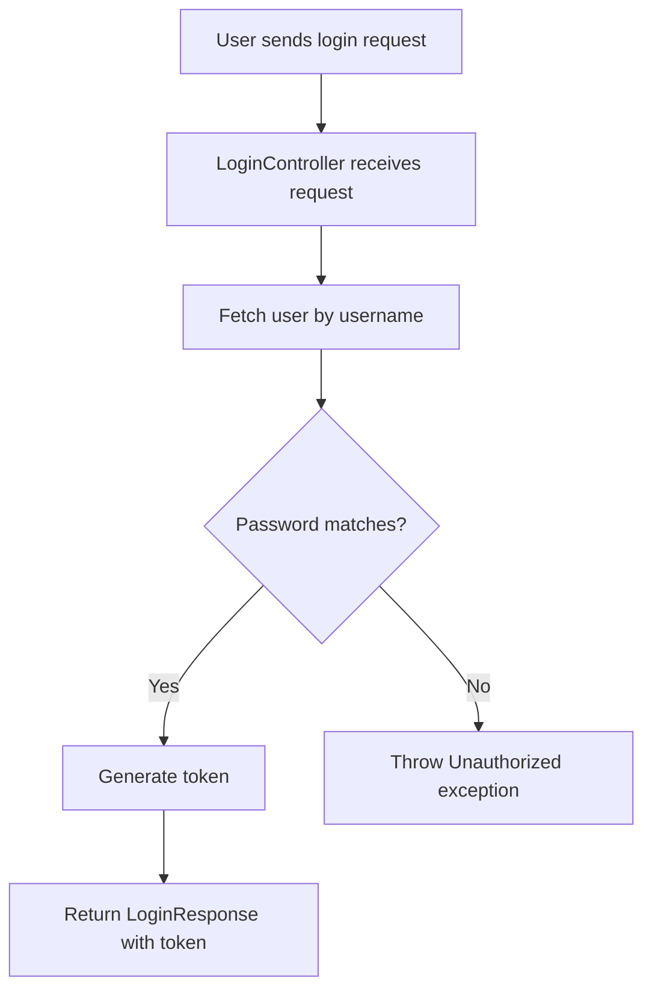
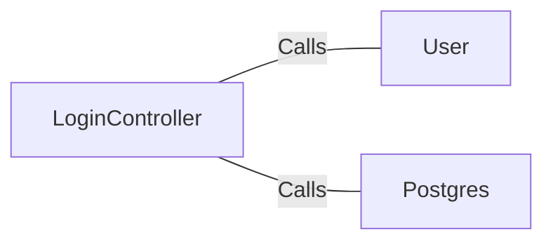

# LoginController.java: Login Controller for User Authentication

## Overview
The `LoginController` class handles user login requests. It validates user credentials and returns a token if the credentials are correct. If the credentials are invalid, it throws an `Unauthorized` exception.

## Process Flow

## Insights
- The `LoginController` class is annotated with `@RestController` and `@EnableAutoConfiguration`, indicating it is a Spring Boot controller with automatic configuration.
- The `login` method handles POST requests to the `/login` endpoint, consuming and producing JSON.
- The `@CrossOrigin` annotation allows cross-origin requests from any origin.
- The `secret` field is injected from the application's properties using the `@Value` annotation.
- The `login` method fetches the user by username and compares the hashed password with the stored hashed password.
- If the passwords match, a token is generated and returned in a `LoginResponse`.
- If the passwords do not match, an `Unauthorized` exception is thrown.

## Dependencies

- `User`: Fetches user details by username.
- `Postgres`: Hashes the input password using the MD5 algorithm.

## Data Manipulation (SQL)
- The `User` class is assumed to interact with a database to fetch user details, but the specific SQL operations are not shown in the provided code.
