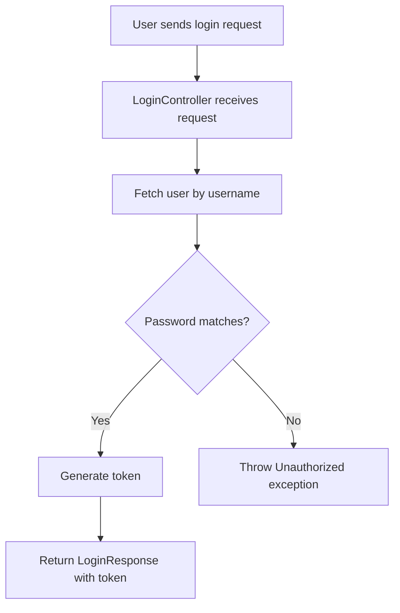
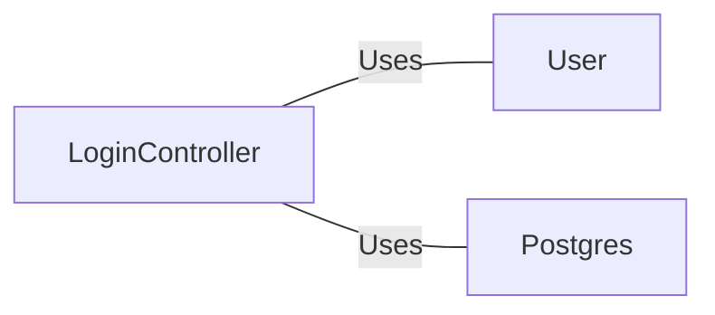

# LoginController.java: Login Controller for User Authentication

## Overview
The `LoginController` class handles user login requests. It validates user credentials and returns a token if the credentials are correct. If the credentials are invalid, it throws an `Unauthorized` exception.

## Process Flow

```mermaid
flowchart TD
    A["User sends login request"] --> B["LoginController receives request"]
    B --> C["Fetch user by username"]
    C --> D{"Password matches?"}
    D --> |"Yes"| E["Generate token"]
    E --> F["Return LoginResponse with token"]
    D --> |"No"| G["Throw Unauthorized exception"]
```

## Insights
- The `LoginController` class is annotated with `@RestController` and `@EnableAutoConfiguration`, indicating it is a Spring Boot controller with automatic configuration.
- The `login` method handles POST requests to the `/login` endpoint, consuming and producing JSON.
- The `@CrossOrigin` annotation allows cross-origin requests from any origin.
- The `login` method fetches the user by username and compares the hashed password with the stored hashed password.
- If the password matches, a token is generated and returned in the `LoginResponse`.
- If the password does not match, an `Unauthorized` exception is thrown.

## Dependencies

```mermaid
flowchart LR
    LoginController --- |"Uses"| User
    LoginController --- |"Uses"| Postgres
```

- `User`: Fetches user details by username.
- `Postgres`: Provides the `md5` method to hash the password.

## Data Manipulation (SQL)
- `User`: Fetches user details by username.

### User Table Structure
| Attribute       | Type   | Description                  |
|-----------------|--------|------------------------------|
| username        | String | The username of the user     |
| hashedPassword  | String | The hashed password of the user |

## Vulnerabilities
- **Hardcoded Secret**: The secret used for token generation is fetched from application properties, which might be hardcoded and not securely managed.
- **Cross-Origin Resource Sharing (CORS)**: Allowing all origins with `@CrossOrigin(origins = "*")` can expose the application to security risks.
- **Password Hashing**: Using MD5 for password hashing is insecure as MD5 is considered cryptographically broken and unsuitable for further use. Consider using a stronger hashing algorithm like bcrypt or Argon2.
- **Exception Handling**: Throwing a generic `Unauthorized` exception without logging or additional context can make debugging and monitoring more difficult.
