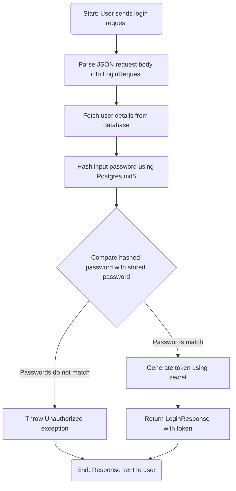
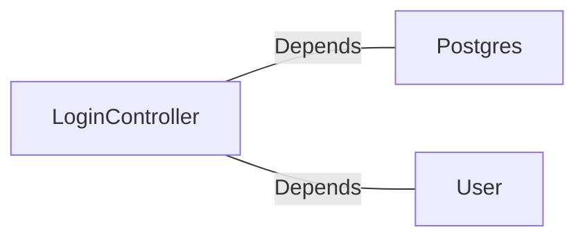

# LoginController.java: Login Management Controller

## Overview
This code defines a `LoginController` class that handles user login requests in a Spring Boot application. It validates user credentials against stored hashed passwords and generates a token for successful authentication. The controller also includes custom exception handling for unauthorized access.

## Process Flow

```mermaid
flowchart TD
    Start("Start: User sends login request")
    ParseRequest["Parse JSON request body into LoginRequest"]
    FetchUser["Fetch user details from database"]
    HashPassword["Hash input password using Postgres.md5"]
    ComparePasswords{"Compare hashed password with stored password"}
    AccessDenied["Throw Unauthorized exception"]
    GenerateToken["Generate token using secret"]
    ReturnResponse["Return LoginResponse with token"]
    End("End: Response sent to user")

    Start --> ParseRequest
    ParseRequest --> FetchUser
    FetchUser --> HashPassword
    HashPassword --> ComparePasswords
    ComparePasswords --> |"Passwords match"| GenerateToken
    ComparePasswords --> |"Passwords do not match"| AccessDenied
    AccessDenied --> End
    GenerateToken --> ReturnResponse
    ReturnResponse --> End
```

## Insights
- The `@RestController` annotation indicates that this class is a RESTful controller.
- The `@CrossOrigin` annotation allows cross-origin requests from any domain.
- The `/login` endpoint accepts POST requests with JSON payloads and returns a JSON response.
- The `@Value` annotation is used to inject the application secret from the configuration.
- The `LoginRequest` and `LoginResponse` classes are simple data transfer objects (DTOs) for handling request and response data.
- The `Unauthorized` class is a custom exception that maps to HTTP 401 Unauthorized status.
- The code uses `Postgres.md5` for password hashing, which may have security implications.

## Dependencies

```mermaid
flowchart LR
    LoginController --- |"Depends"| Postgres
    LoginController --- |"Depends"| User
```

- `Postgres`: Used for hashing the input password with the `md5` method.
- `User`: Represents the user entity and is used to fetch user details and generate tokens.

### External References
- `Postgres`: Provides the `md5` method for hashing passwords.
- `User`: Fetches user details based on the username and generates tokens using the application secret.

## Vulnerabilities
1. **Hardcoded Cross-Origin Policy**:
   - The `@CrossOrigin(origins = "*")` annotation allows requests from any origin, which can expose the application to Cross-Origin Resource Sharing (CORS) attacks.

2. **Weak Password Hashing**:
   - The use of `Postgres.md5` for password hashing is insecure. MD5 is considered cryptographically broken and unsuitable for further use. A stronger hashing algorithm like bcrypt or Argon2 should be used.

3. **Potential User Enumeration**:
   - The code fetches the user details before verifying the password. This can lead to user enumeration attacks if the application responds differently for invalid usernames versus invalid passwords.

4. **Lack of Rate Limiting**:
   - The code does not implement rate limiting, making it vulnerable to brute force attacks.

5. **Token Generation Logic**:
   - The token generation logic is not shown in the `User.token` method. If the token is not securely generated, it could lead to security vulnerabilities.

6. **Error Handling**:
   - The `Unauthorized` exception provides a generic "Access Denied" message. While this is good for security, additional logging should be implemented to track failed login attempts for auditing purposes.
