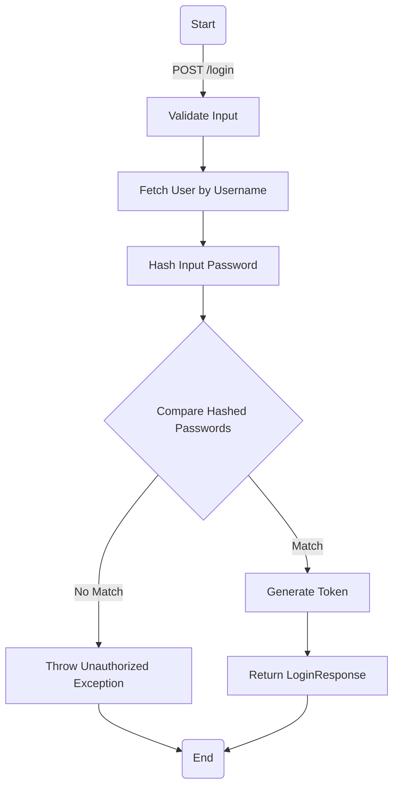
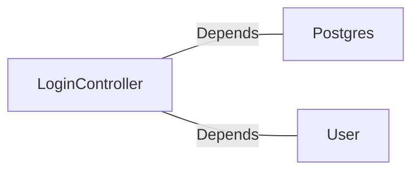

# LoginController.java: Login Authentication Controller

## Overview
This Java program implements a RESTful API endpoint for user login authentication. It validates user credentials against stored data and generates a token upon successful authentication. The program uses Spring Boot for web application development and includes error handling for unauthorized access.

## Process Flow

```mermaid
flowchart TD
    Start("Start") --> |"POST /login"| ValidateInput["Validate Input"]
    ValidateInput --> FetchUser["Fetch User by Username"]
    FetchUser --> HashPassword["Hash Input Password"]
    HashPassword --> ComparePasswords{"Compare Hashed Passwords"}
    ComparePasswords --> |"Match"| GenerateToken["Generate Token"]
    ComparePasswords --> |"No Match"| ThrowUnauthorized["Throw Unauthorized Exception"]
    GenerateToken --> ReturnResponse["Return LoginResponse"]
    ThrowUnauthorized --> End("End")
    ReturnResponse --> End
```

## Insights
- The `@RestController` annotation indicates that this class handles HTTP requests and returns JSON responses.
- The `/login` endpoint accepts POST requests with JSON payloads containing `username` and `password`.
- Passwords are hashed using the `Postgres.md5` method and compared with the stored hashed password.
- A token is generated using the `User.token(secret)` method upon successful authentication.
- Unauthorized access results in an exception (`Unauthorized`) with an HTTP 401 status code.
- The `@CrossOrigin` annotation allows cross-origin requests from any domain.

## Dependencies

```mermaid
flowchart LR
    LoginController --- |"Depends"| Postgres
    LoginController --- |"Depends"| User
```

- `Postgres`: Used for hashing the input password with the `md5` method.
- `User`: Represents the user entity and provides methods like `fetch` (to retrieve user data) and `token` (to generate a token).

### Identified External References
- `Postgres`: Provides the `md5` method for hashing passwords.
- `User`: Provides methods for fetching user data and generating tokens.

## Vulnerabilities
1. **Hardcoded Cross-Origin Policy**:
   - The `@CrossOrigin(origins = "*")` annotation allows requests from any domain, which can lead to Cross-Origin Resource Sharing (CORS) vulnerabilities.
   - **Mitigation**: Restrict the origins to trusted domains.

2. **Potential SQL Injection**:
   - The `User.fetch(input.username)` method may be vulnerable to SQL injection if it directly uses the `username` input in a query without sanitization.
   - **Mitigation**: Use parameterized queries or ORM frameworks to prevent SQL injection.

3. **Weak Password Hashing**:
   - The use of `Postgres.md5` for password hashing is considered weak and outdated.
   - **Mitigation**: Use a stronger hashing algorithm like bcrypt, Argon2, or PBKDF2.

4. **Sensitive Data Exposure**:
   - The `secret` value is injected from the application properties but is not encrypted or secured.
   - **Mitigation**: Store secrets securely using environment variables or a secrets management tool.

5. **Lack of Rate Limiting**:
   - The `/login` endpoint does not implement rate limiting, making it susceptible to brute force attacks.
   - **Mitigation**: Implement rate limiting to restrict the number of login attempts.

6. **Error Message Disclosure**:
   - The `Unauthorized` exception provides a generic "Access Denied" message, which is good practice. However, ensure no detailed error messages are leaked in other parts of the application.
