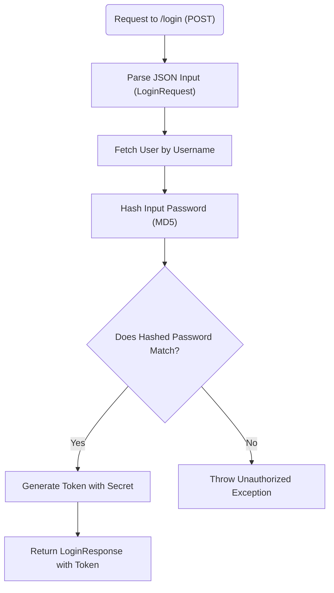
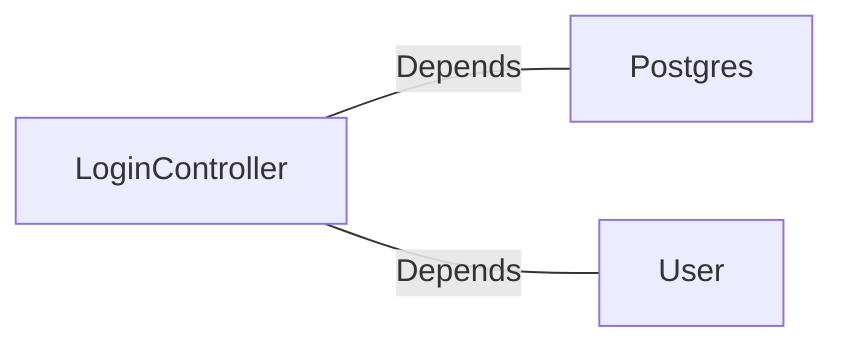

# LoginController.java: Login Management Controller

## Overview
This Java program implements a RESTful API endpoint for user login functionality. It validates user credentials against stored data and generates a token upon successful authentication. The program uses Spring Boot for rapid application development and includes error handling for unauthorized access.

## Process Flow

```mermaid
flowchart TD
    Start("Request to /login (POST)") --> ParseInput["Parse JSON Input (LoginRequest)"]
    ParseInput --> FetchUser["Fetch User by Username"]
    FetchUser --> HashPassword["Hash Input Password (MD5)"]
    HashPassword --> Compare{"Does Hashed Password Match?"}
    Compare -->|Yes| GenerateToken["Generate Token with Secret"]
    GenerateToken --> ReturnResponse["Return LoginResponse with Token"]
    Compare -->|No| ThrowUnauthorized["Throw Unauthorized Exception"]
```

## Insights
- The `/login` endpoint accepts JSON input containing `username` and `password`.
- Passwords are hashed using MD5 for comparison, which is considered insecure by modern standards.
- The `@CrossOrigin` annotation allows requests from any origin, which may pose a security risk.
- The `@Value` annotation is used to inject the application secret from configuration.
- The program throws a custom `Unauthorized` exception with HTTP status 401 when authentication fails.

## Dependencies

```mermaid
flowchart LR
    LoginController --- |"Depends"| Postgres
    LoginController --- |"Depends"| User
```

- `Postgres`: Used for hashing the input password with MD5.
- `User`: Represents the user entity and provides methods to fetch user data and generate tokens.

### External References
- `Postgres`: Provides the `md5` method for hashing passwords.
- `User`: Provides the `fetch` method to retrieve user data by username and the `token` method to generate authentication tokens.

## Vulnerabilities
1. **Insecure Password Hashing (MD5)**:
   - MD5 is a weak hashing algorithm and is vulnerable to collision attacks. It is not recommended for password hashing.
   - Consider using a stronger algorithm like bcrypt, Argon2, or PBKDF2.

2. **Cross-Origin Resource Sharing (CORS)**:
   - The `@CrossOrigin(origins = "*")` annotation allows requests from any origin, which can expose the API to Cross-Site Request Forgery (CSRF) attacks.
   - Restrict origins to trusted domains.

3. **Hardcoded Secret Injection**:
   - The application secret is injected via `@Value("${app.secret}")`. If improperly secured, this secret could be exposed, leading to token forgery.
   - Ensure the secret is stored securely, such as in environment variables or a secrets management system.

4. **Lack of Rate Limiting**:
   - The `/login` endpoint does not implement rate limiting, making it susceptible to brute force attacks.

5. **Error Message Exposure**:
   - The `Unauthorized` exception exposes the message "Access Denied". Avoid exposing detailed error messages to prevent information leakage.

6. **No Input Validation**:
   - The program does not validate the `username` and `password` fields in the `LoginRequest`. This could lead to injection attacks or unexpected behavior.
