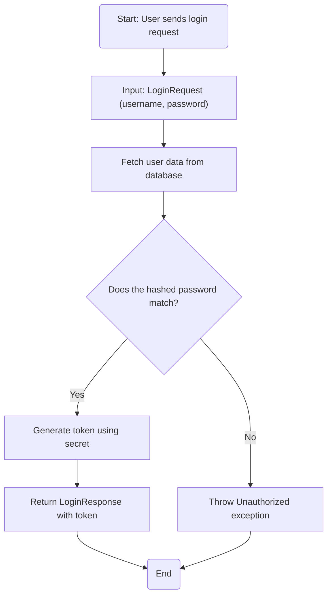
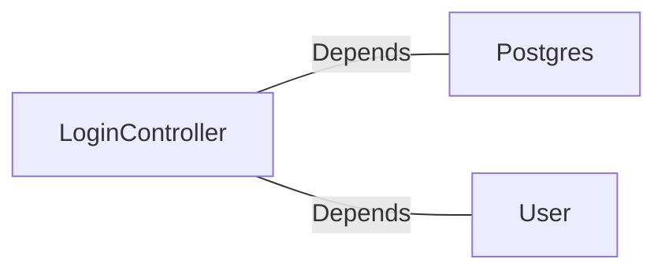

# LoginController.java: User Authentication Controller

## Overview

The `LoginController` class is a RESTful API controller responsible for handling user login requests. It validates user credentials against stored data and generates a token for successful authentication. The controller uses Spring Boot annotations and integrates with a database for user data retrieval and password validation.

## Process Flow

```mermaid
flowchart TD
    Start("Start: User sends login request")
    Input["Input: LoginRequest (username, password)"]
    FetchUser["Fetch user data from database"]
    ValidatePassword{"Does the hashed password match?"}
    GenerateToken["Generate token using secret"]
    ReturnToken["Return LoginResponse with token"]
    AccessDenied["Throw Unauthorized exception"]
    End("End")

    Start --> Input
    Input --> FetchUser
    FetchUser --> ValidatePassword
    ValidatePassword --> |"Yes"| GenerateToken
    ValidatePassword --> |"No"| AccessDenied
    GenerateToken --> ReturnToken
    ReturnToken --> End
    AccessDenied --> End
```

## Insights

- The `@RestController` and `@EnableAutoConfiguration` annotations configure the class as a Spring Boot REST controller.
- The `@CrossOrigin` annotation allows cross-origin requests from any domain.
- The `/login` endpoint accepts POST requests with JSON payloads and returns JSON responses.
- The `LoginRequest` and `LoginResponse` classes are simple data structures for handling input and output.
- Password validation is performed using MD5 hashing, which is considered insecure and should be replaced with a stronger hashing algorithm like bcrypt or Argon2.
- The `secret` value is injected from the application properties and is used to generate user tokens.
- The `Unauthorized` exception is thrown when authentication fails, returning a 401 HTTP status.

## Dependencies

```mermaid
flowchart LR
    LoginController --- |"Depends"| Postgres
    LoginController --- |"Depends"| User
```

- `Postgres`: Used for hashing the password with the `md5` method.
- `User`: Fetches user data from the database, including the hashed password and token generation.

### List of Identified External References

- `Postgres`: Provides the `md5` method for hashing passwords. Nature: Depends.
- `User`: Fetches user data and generates tokens. Nature: Depends.

## Vulnerabilities

1. **Insecure Password Hashing**:
   - The use of MD5 for password hashing is insecure and vulnerable to collision attacks. It should be replaced with a more secure algorithm like bcrypt or Argon2.

2. **Hardcoded Cross-Origin Policy**:
   - The `@CrossOrigin(origins = "*")` annotation allows requests from any origin, which can lead to security risks such as Cross-Site Request Forgery (CSRF). It is recommended to restrict origins to trusted domains.

3. **Potential Information Disclosure**:
   - The `Unauthorized` exception message "Access Denied" could potentially be used to infer the existence of a username. Consider using a generic error message.

4. **Lack of Rate Limiting**:
   - The endpoint does not implement rate limiting, making it susceptible to brute force attacks.

5. **Token Generation Logic**:
   - The token generation logic is not shown in the `User` class, but it should ensure secure practices like using cryptographically strong random values and expiration times.

6. **No Input Validation**:
   - The `LoginRequest` fields (`username` and `password`) are not validated for null or empty values, which could lead to unexpected behavior or errors. Input validation should be added.
