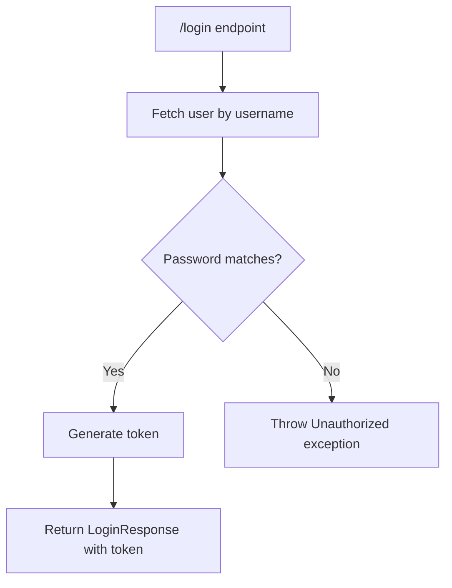
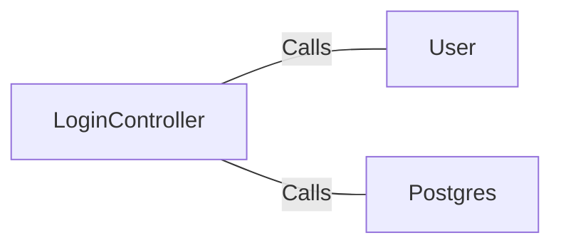

# LoginController.java: Login Controller for User Authentication

## Overview
The `LoginController` class handles user login requests. It validates user credentials and returns a token if the credentials are correct. If the credentials are invalid, it throws an `Unauthorized` exception.

## Process Flow

```mermaid
flowchart TD
    A["/login endpoint"] --> B["Fetch user by username"]
    B --> C{"Password matches?"}
    C -->|Yes| D["Generate token"]
    C -->|No| E["Throw Unauthorized exception"]
    D --> F["Return LoginResponse with token"]
```

## Insights
- The `LoginController` class is annotated with `@RestController` and `@EnableAutoConfiguration`, indicating it is a Spring Boot controller.
- The `login` method handles POST requests to the `/login` endpoint, consuming and producing JSON.
- The `login` method fetches the user by username and compares the hashed password.
- If the password matches, a token is generated and returned in a `LoginResponse`.
- If the password does not match, an `Unauthorized` exception is thrown.
- The `@CrossOrigin` annotation allows cross-origin requests from any origin.

## Dependencies

```mermaid
flowchart LR
    LoginController --- |"Calls"| User
    LoginController --- |"Calls"| Postgres
```

- `User`: Fetches user details by username.
- `Postgres`: Hashes the input password using the MD5 algorithm.

## Data Manipulation (SQL)
- `User`: Fetches user details from the database based on the provided username.

## Vulnerabilities
- **Hardcoded Secret**: The secret used for token generation is fetched from application properties, which might be hardcoded and not securely managed.
- **MD5 Hashing**: The use of MD5 for hashing passwords is insecure and vulnerable to collision attacks. A stronger hashing algorithm like bcrypt should be used.
- **Cross-Origin Resource Sharing (CORS)**: Allowing all origins with `@CrossOrigin(origins = "*")` can expose the application to Cross-Site Request Forgery (CSRF) attacks. It is recommended to restrict the origins to trusted domains.
- **Exception Handling**: The `Unauthorized` exception is thrown without logging, which can make debugging and monitoring difficult. Proper logging should be implemented.
