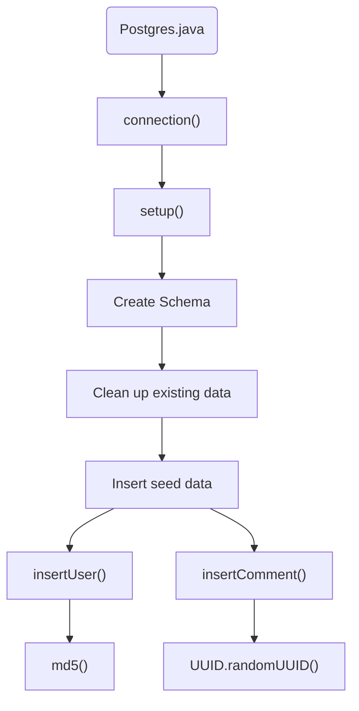
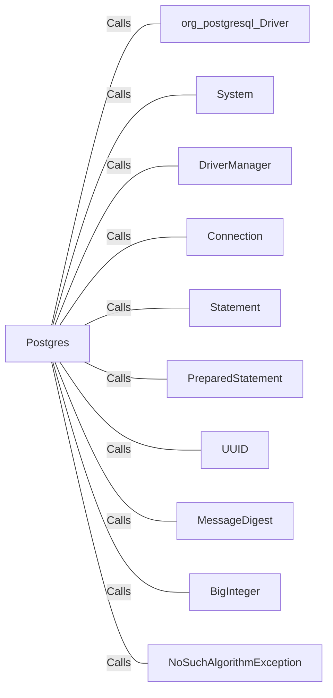

# Postgres.java: PostgreSQL Database Setup and Operations

## Overview
This Java program is responsible for setting up a PostgreSQL database, including creating tables, cleaning up existing data, and inserting seed data. It also includes methods for hashing passwords using MD5 and inserting users and comments into the database.

## Process Flow

## Insights
- The `connection()` method establishes a connection to the PostgreSQL database using environment variables for configuration.
- The `setup()` method creates the necessary tables (`users` and `comments`), cleans up any existing data, and inserts seed data.
- The `md5()` method calculates the MD5 hash value of a given input string, used for hashing passwords.
- The `insertUser()` and `insertComment()` methods insert data into the `users` and `comments` tables, respectively, using prepared statements to prevent SQL injection.

## Dependencies

- `org_postgresql_Driver`: Used to load the PostgreSQL JDBC driver.
- `System`: Used to retrieve environment variables for database configuration.
- `DriverManager`: Used to establish a connection to the PostgreSQL database.
- `Connection`: Represents a connection to the database.
- `Statement`: Used to execute SQL statements.
- `PreparedStatement`: Used to execute parameterized SQL statements.
- `UUID`: Used to generate unique identifiers for users and comments.
- `MessageDigest`: Used to compute the MD5 hash of passwords.
- `BigInteger`: Used to convert the byte array from the MD5 hash into a hexadecimal string.
- `NoSuchAlgorithmException`: Exception thrown when the MD5 algorithm is not available.

## Data Manipulation (SQL)
### Table Structures
#### `users`
| Attribute   | Type         | Description                          |
|-------------|--------------|--------------------------------------|
| user_id     | VARCHAR(36)  | Primary key, unique identifier for the user |
| username    | VARCHAR(50)  | Unique, not null, username of the user |
| password    | VARCHAR(50)  | Not null, hashed password of the user |
| created_on  | TIMESTAMP    | Not null, timestamp of user creation |
| last_login  | TIMESTAMP    | Timestamp of last login (optional)   |

#### `comments`
| Attribute   | Type         | Description                          |
|-------------|--------------|--------------------------------------|
| id          | VARCHAR(36)  | Primary key, unique identifier for the comment |
| username    | VARCHAR(36)  | Username of the user who made the comment |
| body        | VARCHAR(500) | Content of the comment               |
| created_on  | TIMESTAMP    | Not null, timestamp of comment creation |

### SQL Operations
- `CREATE TABLE IF NOT EXISTS users`: Creates the `users` table if it does not already exist.
- `CREATE TABLE IF NOT EXISTS comments`: Creates the `comments` table if it does not already exist.
- `DELETE FROM users`: Deletes all existing data from the `users` table.
- `DELETE FROM comments`: Deletes all existing data from the `comments` table.
- `INSERT INTO users`: Inserts a new user into the `users` table.
- `INSERT INTO comments`: Inserts a new comment into the `comments` table.

## Vulnerabilities
- **Hardcoded Passwords**: The seed data includes hardcoded passwords, which is not a secure practice.
- **MD5 Hashing**: MD5 is considered a weak hashing algorithm and is vulnerable to collision attacks. It is recommended to use a stronger hashing algorithm like SHA-256 or bcrypt.
- **Environment Variables**: The program relies on environment variables for database configuration, which can be a security risk if not properly managed.
- **Error Handling**: The program uses `e.printStackTrace()` for error handling, which can expose sensitive information in logs. It is recommended to use proper logging mechanisms and handle exceptions securely.
