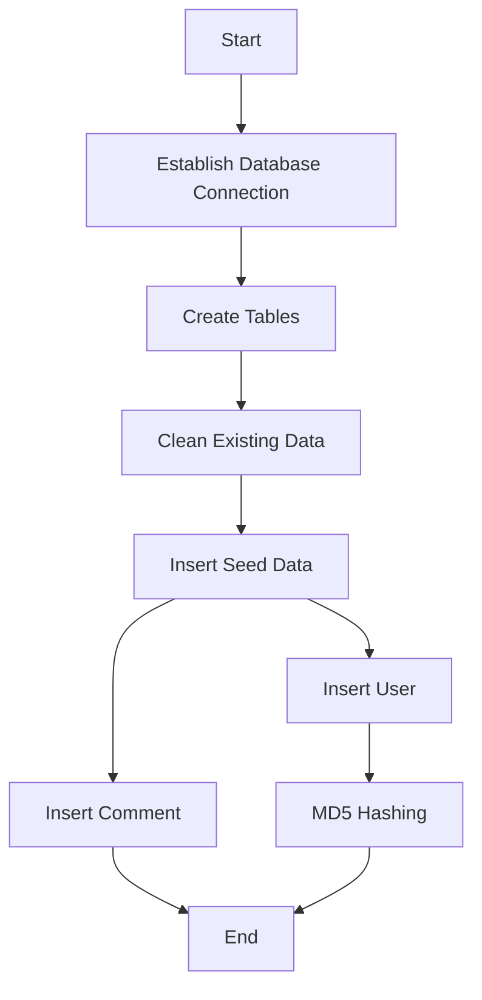
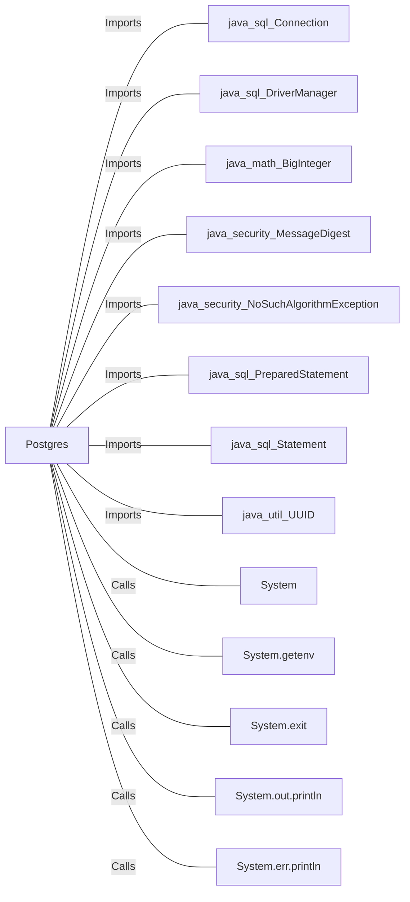

# Postgres.java: Database Setup and Interaction

## Overview
This Java program is responsible for setting up and interacting with a PostgreSQL database. It includes methods to establish a connection, create necessary tables, insert seed data, and perform MD5 hashing for passwords.

## Process Flow

## Insights
- The program sets up a PostgreSQL database by creating `users` and `comments` tables.
- It cleans up any existing data in these tables before inserting seed data.
- Passwords are hashed using the MD5 algorithm before being stored in the database.
- The program uses environment variables to get database connection details.
- The `UUID` class is used to generate unique identifiers for users and comments.

## Dependencies

- `java_sql_Connection`: Used to establish a connection to the database.
- `java_sql_DriverManager`: Used to get the database connection.
- `java_math_BigInteger`: Used in the MD5 hashing process.
- `java_security_MessageDigest`: Used to perform MD5 hashing.
- `java_security_NoSuchAlgorithmException`: Exception handling for MD5 hashing.
- `java_sql_PreparedStatement`: Used to execute SQL queries with parameters.
- `java_sql_Statement`: Used to execute SQL queries.
- `java_util_UUID`: Used to generate unique identifiers.
- `System`: Used for various system operations like printing to console and exiting the program.
- `System.getenv`: Used to get environment variables.
- `System.exit`: Used to terminate the program.
- `System.out.println`: Used to print messages to the console.
- `System.err.println`: Used to print error messages to the console.

## Data Manipulation (SQL)
### Table Structures
| Table Name | Column Name | Data Type | Description |
|------------|-------------|-----------|-------------|
| users      | user_id     | VARCHAR(36) | Primary key, unique identifier for the user |
|            | username    | VARCHAR(50) | Unique, not null, username of the user |
|            | password    | VARCHAR(50) | Not null, hashed password of the user |
|            | created_on  | TIMESTAMP   | Not null, timestamp when the user was created |
|            | last_login  | TIMESTAMP   | Timestamp of the user's last login |
| comments   | id          | VARCHAR(36) | Primary key, unique identifier for the comment |
|            | username    | VARCHAR(36) | Username of the user who made the comment |
|            | body        | VARCHAR(500)| Body of the comment |
|            | created_on  | TIMESTAMP   | Not null, timestamp when the comment was created |

### SQL Operations
- `CREATE TABLE IF NOT EXISTS users`: Creates the `users` table if it does not exist.
- `CREATE TABLE IF NOT EXISTS comments`: Creates the `comments` table if it does not exist.
- `DELETE FROM users`: Deletes all existing data from the `users` table.
- `DELETE FROM comments`: Deletes all existing data from the `comments` table.
- `INSERT INTO users`: Inserts a new user into the `users` table.
- `INSERT INTO comments`: Inserts a new comment into the `comments` table.

## Vulnerabilities
- **Hardcoded Passwords**: The seed data includes hardcoded passwords, which is a security risk.
- **MD5 Hashing**: MD5 is considered a weak hashing algorithm and is vulnerable to collision attacks. It is recommended to use a stronger hashing algorithm like SHA-256 or bcrypt.
- **Environment Variables**: The program relies on environment variables for database connection details. Ensure these variables are securely managed and not exposed.
- **SQL Injection**: Although `PreparedStatement` is used, it is important to validate and sanitize inputs to prevent SQL injection attacks.
