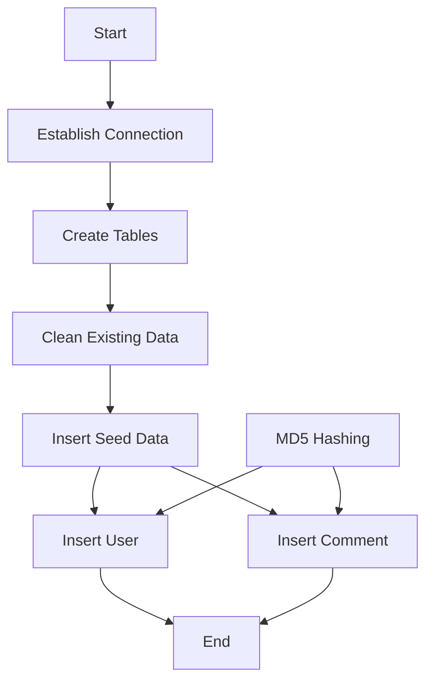
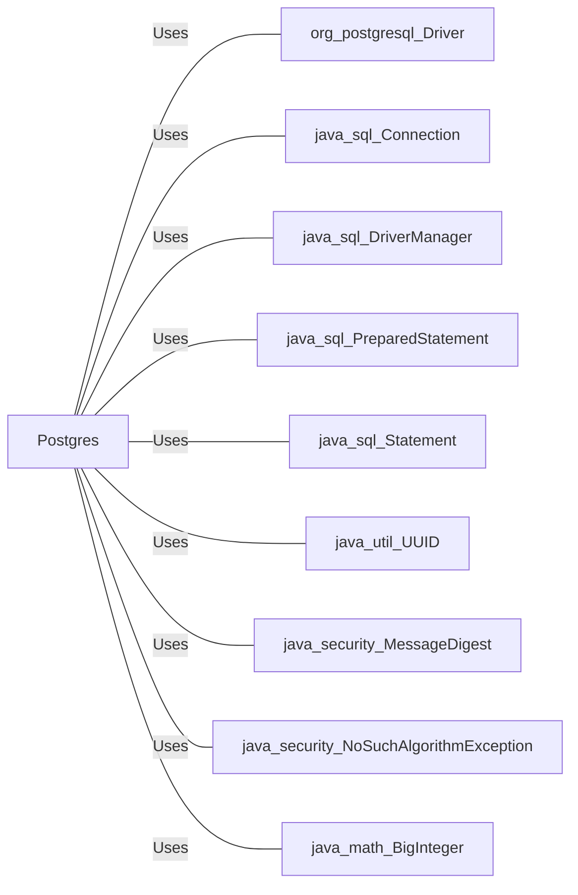

# Postgres.java: Database Setup and Interaction

## Overview
This Java program is responsible for setting up and interacting with a PostgreSQL database. It includes methods to establish a connection, create necessary tables, insert seed data, and perform MD5 hashing for passwords.

## Process Flow

## Insights
- The program establishes a connection to a PostgreSQL database using environment variables for configuration.
- It creates two tables: `users` and `comments`.
- Existing data in these tables is deleted before inserting seed data.
- Passwords are hashed using MD5 before being stored in the database.
- The program includes methods to insert users and comments into the database.

## Dependencies

- `org.postgresql.Driver`: Used to load the PostgreSQL driver.
- `java.sql.Connection`: Used to establish a connection to the database.
- `java.sql.DriverManager`: Used to get the database connection.
- `java.sql.PreparedStatement`: Used to execute parameterized SQL queries.
- `java.sql.Statement`: Used to execute SQL statements.
- `java.util.UUID`: Used to generate unique identifiers for users and comments.
- `java.security.MessageDigest`: Used for MD5 hashing of passwords.
- `java.security.NoSuchAlgorithmException`: Exception thrown when a particular cryptographic algorithm is requested but is not available in the environment.
- `java.math.BigInteger`: Used to handle large integer values, particularly for converting byte arrays to hexadecimal strings.

## Data Manipulation (SQL)
### Table Structures
#### `users`
| Attribute   | Type         | Description                          |
|-------------|--------------|--------------------------------------|
| user_id     | VARCHAR(36)  | Primary key, unique identifier       |
| username    | VARCHAR(50)  | Unique, not null                     |
| password    | VARCHAR(50)  | Not null, stores MD5 hashed password |
| created_on  | TIMESTAMP    | Not null, timestamp of creation      |
| last_login  | TIMESTAMP    | Timestamp of last login              |

#### `comments`
| Attribute   | Type         | Description                          |
|-------------|--------------|--------------------------------------|
| id          | VARCHAR(36)  | Primary key, unique identifier       |
| username    | VARCHAR(36)  | Username of the commenter            |
| body        | VARCHAR(500) | Comment text                         |
| created_on  | TIMESTAMP    | Not null, timestamp of creation      |

### SQL Operations
- `CREATE TABLE IF NOT EXISTS users`: Creates the `users` table if it does not already exist.
- `CREATE TABLE IF NOT EXISTS comments`: Creates the `comments` table if it does not already exist.
- `DELETE FROM users`: Deletes all existing data from the `users` table.
- `DELETE FROM comments`: Deletes all existing data from the `comments` table.
- `INSERT INTO users`: Inserts a new user into the `users` table.
- `INSERT INTO comments`: Inserts a new comment into the `comments` table.

## Vulnerabilities
- **Hardcoded Passwords**: The seed data includes hardcoded passwords, which is a security risk.
- **MD5 Hashing**: MD5 is considered a weak hashing algorithm and is vulnerable to collision attacks. It is recommended to use a stronger hashing algorithm like SHA-256 or bcrypt.
- **Environment Variables**: The program relies on environment variables for database configuration, which should be securely managed to avoid exposure.
- **SQL Injection**: Although the program uses `PreparedStatement` for inserting data, it is important to ensure that all user inputs are properly sanitized to prevent SQL injection attacks.
