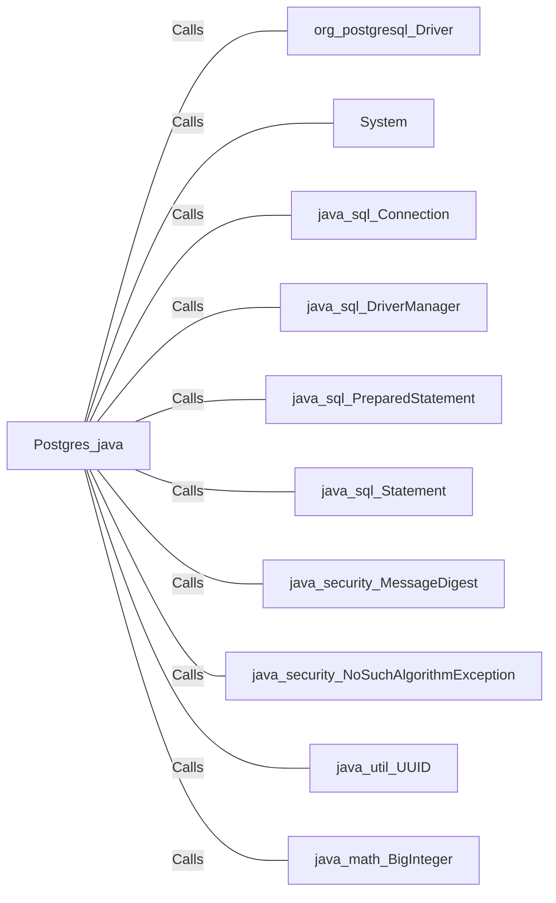

# Postgres.java: PostgreSQL Database Setup and Interaction

## Overview
This Java program is responsible for setting up and interacting with a PostgreSQL database. It includes methods for establishing a database connection, creating tables, inserting seed data, and hashing passwords using MD5.

## Process Flow
```mermaid
flowchart TD
    start("Start")
    setup["setup()"]
    connection["connection()"]
    create_tables["Create Tables"]
    clean_data["Clean Existing Data"]
    insert_seed_data["Insert Seed Data"]
    insertUser["insertUser(username, password)"]
    insertComment["insertComment(username, body)"]
    md5["md5(input)"]
    end("End")

    start --> setup
    setup --> connection
    connection --> create_tables
    create_tables --> clean_data
    clean_data --> insert_seed_data
    insert_seed_data --> insertUser
    insert_seed_data --> insertComment
    insertUser --> md5
    insertComment --> end
```

## Insights
- The program sets up a PostgreSQL database by creating `users` and `comments` tables.
- It cleans up any existing data in these tables before inserting seed data.
- Passwords are hashed using the MD5 algorithm before being stored in the database.
- The `connection()` method retrieves database connection details from environment variables.
- The `setup()` method orchestrates the database setup process, including table creation and data insertion.

## Dependencies


- `org_postgresql_Driver`: Used to load the PostgreSQL JDBC driver.
- `System`: Used to retrieve environment variables for database connection details.
- `java_sql_Connection`: Represents a connection to the database.
- `java_sql_DriverManager`: Manages database connections.
- `java_sql_PreparedStatement`: Used to execute parameterized SQL queries.
- `java_sql_Statement`: Used to execute SQL statements.
- `java_security_MessageDigest`: Used to compute MD5 hash for passwords.
- `java_security_NoSuchAlgorithmException`: Exception thrown when a particular cryptographic algorithm is requested but is not available.
- `java_util_UUID`: Used to generate unique identifiers for database records.
- `java_math_BigInteger`: Used to handle large integer values, particularly for converting byte arrays to hexadecimal strings.

## Data Manipulation (SQL)
### Tables
#### users
| Attribute   | Type          | Description                        |
|-------------|---------------|------------------------------------|
| user_id     | VARCHAR(36)   | Primary key, unique user identifier|
| username    | VARCHAR(50)   | Unique, not null, username         |
| password    | VARCHAR(50)   | Not null, hashed password          |
| created_on  | TIMESTAMP     | Not null, timestamp of creation    |
| last_login  | TIMESTAMP     | Timestamp of last login            |

#### comments
| Attribute   | Type          | Description                        |
|-------------|---------------|------------------------------------|
| id          | VARCHAR(36)   | Primary key, unique comment identifier |
| username    | VARCHAR(36)   | Username associated with the comment |
| body        | VARCHAR(500)  | Comment text                       |
| created_on  | TIMESTAMP     | Not null, timestamp of creation    |

### SQL Operations
- `CREATE TABLE`: Creates `users` and `comments` tables if they do not exist.
- `DELETE`: Cleans up any existing data in `users` and `comments` tables.
- `INSERT`: Inserts seed data into `users` and `comments` tables.
