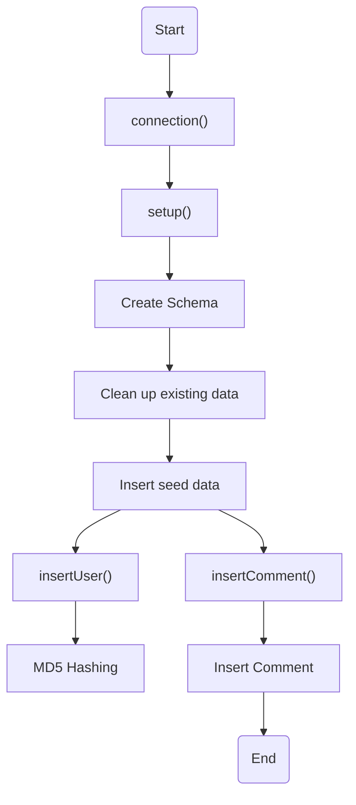
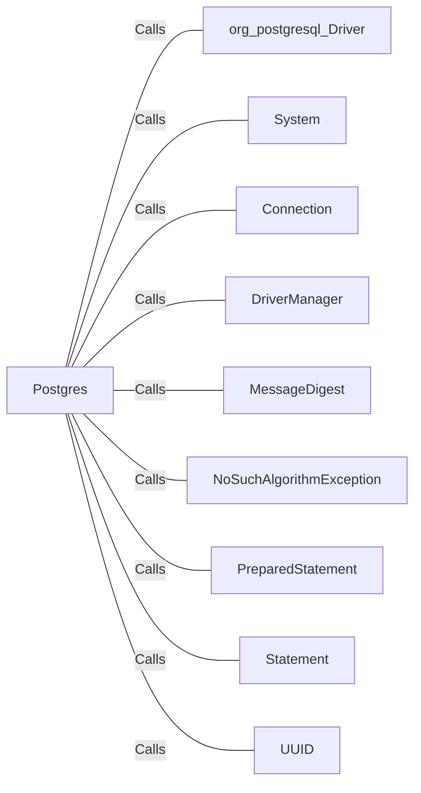

# Postgres.java: Database Setup and Interaction

## Overview
This Java program is responsible for setting up and interacting with a PostgreSQL database. It includes methods for establishing a connection, creating tables, inserting seed data, and hashing passwords using MD5.

## Process Flow

```mermaid
flowchart TD
    A("Start") --> B["connection()"]
    B --> C["setup()"]
    C --> D["Create Schema"]
    D --> E["Clean up existing data"]
    E --> F["Insert seed data"]
    F --> G["insertUser()"]
    F --> H["insertComment()"]
    G --> I["MD5 Hashing"]
    H --> J["Insert Comment"]
    J --> K("End")
```

## Insights
- The program sets up a PostgreSQL database by creating tables and inserting seed data.
- Passwords are hashed using MD5 before being stored in the database.
- The program uses environment variables to configure the database connection.
- The `setup()` method cleans up any existing data in the tables before inserting new seed data.

## Dependencies

```mermaid
flowchart LR
    Postgres --- |"Calls"| org_postgresql_Driver
    Postgres --- |"Calls"| System
    Postgres --- |"Calls"| Connection
    Postgres --- |"Calls"| DriverManager
    Postgres --- |"Calls"| MessageDigest
    Postgres --- |"Calls"| NoSuchAlgorithmException
    Postgres --- |"Calls"| PreparedStatement
    Postgres --- |"Calls"| Statement
    Postgres --- |"Calls"| UUID
```

- `org_postgresql_Driver`: Used to load the PostgreSQL driver class.
- `System`: Accesses environment variables for database configuration.
- `Connection`: Establishes a connection to the PostgreSQL database.
- `DriverManager`: Manages the database connection.
- `MessageDigest`: Used for MD5 hashing of passwords.
- `NoSuchAlgorithmException`: Handles exceptions related to the MD5 hashing algorithm.
- `PreparedStatement`: Executes SQL queries with parameters.
- `Statement`: Executes SQL queries.
- `UUID`: Generates unique identifiers for users and comments.

## Data Manipulation (SQL)
### Table Structures
#### `users`
| Attribute   | Type         | Description                          |
|-------------|--------------|--------------------------------------|
| user_id     | VARCHAR(36)  | Primary key, unique identifier       |
| username    | VARCHAR(50)  | Unique, not null                     |
| password    | VARCHAR(50)  | Not null, MD5 hashed password        |
| created_on  | TIMESTAMP    | Not null, timestamp of creation      |
| last_login  | TIMESTAMP    | Timestamp of last login              |

#### `comments`
| Attribute   | Type         | Description                          |
|-------------|--------------|--------------------------------------|
| id          | VARCHAR(36)  | Primary key, unique identifier       |
| username    | VARCHAR(36)  | Username of the commenter            |
| body        | VARCHAR(500) | Comment text                         |
| created_on  | TIMESTAMP    | Not null, timestamp of creation      |

### SQL Operations
- `CREATE TABLE IF NOT EXISTS users`: Creates the `users` table if it does not exist.
- `CREATE TABLE IF NOT EXISTS comments`: Creates the `comments` table if it does not exist.
- `DELETE FROM users`: Deletes all existing data from the `users` table.
- `DELETE FROM comments`: Deletes all existing data from the `comments` table.
- `INSERT INTO users`: Inserts seed data into the `users` table.
- `INSERT INTO comments`: Inserts seed data into the `comments` table.

## Vulnerabilities
- **MD5 Hashing**: MD5 is considered a weak hashing algorithm and is vulnerable to collision attacks. It is recommended to use a stronger hashing algorithm like SHA-256 or bcrypt for password hashing.
- **Environment Variables**: The program relies on environment variables for database configuration, which can be a security risk if not properly managed. Ensure that environment variables are securely stored and accessed.
- **SQL Injection**: Although the program uses `PreparedStatement` to prevent SQL injection, it is important to validate and sanitize all user inputs to further mitigate this risk.
