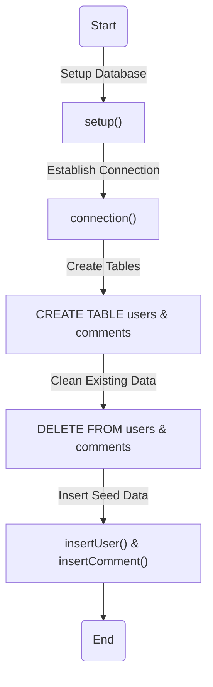
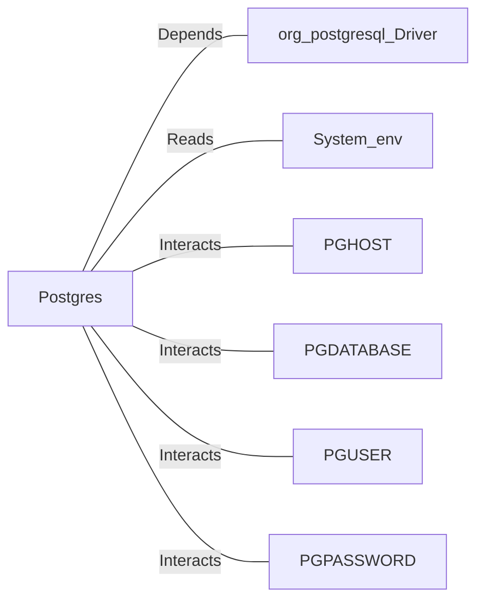

# Postgres.java: Database Setup and Interaction Utility

## Overview

This Java class, `Postgres`, is responsible for setting up and interacting with a PostgreSQL database. It provides methods to establish a database connection, create necessary tables, seed initial data, and perform basic operations such as inserting users and comments. Additionally, it includes a utility method to hash passwords using the MD5 algorithm.

## Process Flow

```mermaid
flowchart TD
    Start("Start") --> |"Setup Database"| SetupDB["setup()"]
    SetupDB --> |"Establish Connection"| Connection["connection()"]
    Connection --> |"Create Tables"| CreateTables["CREATE TABLE users & comments"]
    CreateTables --> |"Clean Existing Data"| CleanData["DELETE FROM users & comments"]
    CleanData --> |"Insert Seed Data"| SeedData["insertUser() & insertComment()"]
    SeedData --> End("End")
```

## Insights

- **Database Connection**: The `connection()` method dynamically constructs the database URL using environment variables (`PGHOST`, `PGDATABASE`, `PGUSER`, `PGPASSWORD`) and establishes a connection to the PostgreSQL database.
- **Schema Setup**: The `setup()` method creates two tables (`users` and `comments`) if they do not already exist and ensures a clean slate by deleting any existing data.
- **Password Hashing**: The `md5()` method hashes passwords using the MD5 algorithm before storing them in the database.
- **Data Seeding**: The `setup()` method seeds the database with predefined users and comments for initial testing or demonstration purposes.
- **Prepared Statements**: The `insertUser()` and `insertComment()` methods use `PreparedStatement` to prevent SQL injection and ensure secure data insertion.
- **UUID Usage**: Unique identifiers for users and comments are generated using `UUID.randomUUID()`.

## Dependencies

```mermaid
flowchart LR
    Postgres --- |"Depends"| org_postgresql_Driver
    Postgres --- |"Reads"| System_env
    Postgres --- |"Interacts"| PGHOST
    Postgres --- |"Interacts"| PGDATABASE
    Postgres --- |"Interacts"| PGUSER
    Postgres --- |"Interacts"| PGPASSWORD
```

- `org.postgresql.Driver`: Required for connecting to the PostgreSQL database.
- `System.getenv`: Reads environment variables for database connection details.
- `PGHOST`, `PGDATABASE`, `PGUSER`, `PGPASSWORD`: Environment variables used to configure the database connection.

## Data Manipulation (SQL)

### Table Structures

#### `users` Table
| Attribute    | Data Type       | Description                                      |
|--------------|-----------------|--------------------------------------------------|
| `user_id`    | `VARCHAR(36)`   | Primary key, unique identifier for the user.     |
| `username`   | `VARCHAR(50)`   | Unique username for the user.                   |
| `password`   | `VARCHAR(50)`   | MD5-hashed password.                            |
| `created_on` | `TIMESTAMP`     | Timestamp of user creation.                     |
| `last_login` | `TIMESTAMP`     | Timestamp of the last login (nullable).         |

#### `comments` Table
| Attribute    | Data Type       | Description                                      |
|--------------|-----------------|--------------------------------------------------|
| `id`         | `VARCHAR(36)`   | Primary key, unique identifier for the comment.  |
| `username`   | `VARCHAR(36)`   | Username of the commenter.                      |
| `body`       | `VARCHAR(500)`  | Content of the comment.                         |
| `created_on` | `TIMESTAMP`     | Timestamp of comment creation.                  |

### SQL Operations

- **`CREATE TABLE`**: Creates the `users` and `comments` tables if they do not exist.
- **`DELETE`**: Cleans up existing data in the `users` and `comments` tables.
- **`INSERT`**: Adds new users and comments to the respective tables.

## Vulnerabilities

1. **MD5 for Password Hashing**:
   - MD5 is considered cryptographically insecure and should not be used for password hashing. A more secure algorithm like bcrypt, Argon2, or PBKDF2 should be used.

2. **Environment Variable Exposure**:
   - The database credentials are fetched from environment variables, which could be exposed if not properly secured.

3. **Error Handling**:
   - Exceptions are printed to the console, which may expose sensitive information. Proper logging mechanisms should be used instead.

4. **Hardcoded Seed Data**:
   - The seed data includes hardcoded passwords, which is a security risk. These should be securely hashed and stored.

5. **Lack of Input Validation**:
   - The `insertUser()` and `insertComment()` methods do not validate input, which could lead to unexpected behavior or vulnerabilities.
