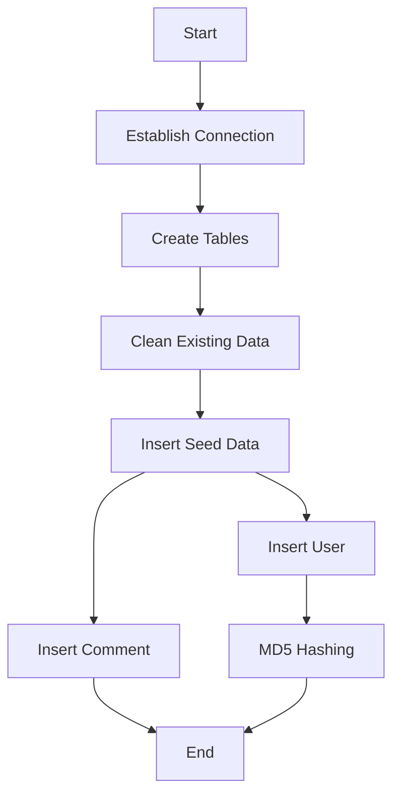
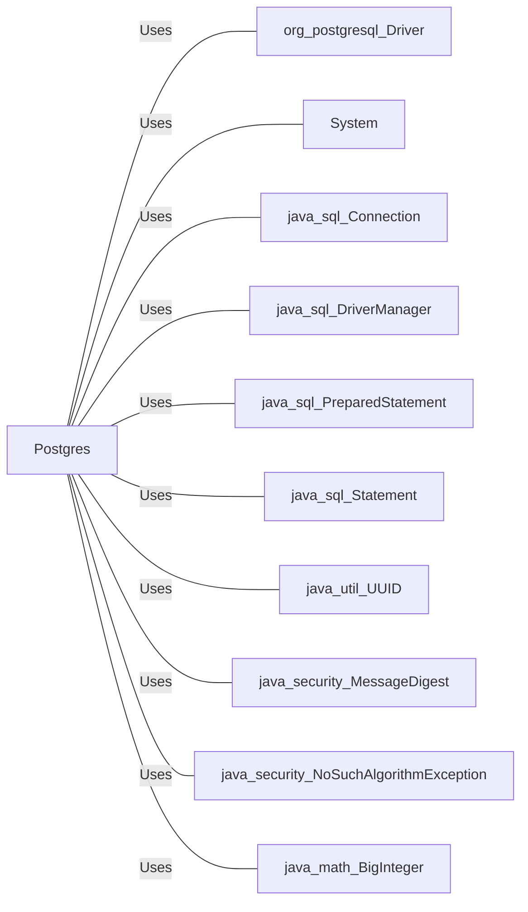

# Postgres.java: Database Setup and Interaction

## Overview
This Java program is responsible for setting up and interacting with a PostgreSQL database. It includes methods to establish a connection, create necessary tables, insert seed data, and perform MD5 hashing for passwords.

## Process Flow

```mermaid
flowchart TD
    A["Start"]
    B["Establish Connection"]
    C["Create Tables"]
    D["Clean Existing Data"]
    E["Insert Seed Data"]
    F["Insert User"]
    G["Insert Comment"]
    H["MD5 Hashing"]
    I["End"]

    A --> B
    B --> C
    C --> D
    D --> E
    E --> F
    E --> G
    F --> H
    G --> I
    H --> I
```

## Insights
- The program sets up a PostgreSQL database connection using environment variables for configuration.
- It creates two tables: `users` and `comments`.
- Existing data in these tables is deleted before inserting seed data.
- Passwords are hashed using the MD5 algorithm before being stored in the database.
- The program includes methods to insert users and comments into the database.

## Dependencies

```mermaid
flowchart LR
    Postgres --- |"Uses"| org_postgresql_Driver
    Postgres --- |"Uses"| System
    Postgres --- |"Uses"| java_sql_Connection
    Postgres --- |"Uses"| java_sql_DriverManager
    Postgres --- |"Uses"| java_sql_PreparedStatement
    Postgres --- |"Uses"| java_sql_Statement
    Postgres --- |"Uses"| java_util_UUID
    Postgres --- |"Uses"| java_security_MessageDigest
    Postgres --- |"Uses"| java_security_NoSuchAlgorithmException
    Postgres --- |"Uses"| java_math_BigInteger
```

- `org.postgresql.Driver`: Used to load the PostgreSQL JDBC driver.
- `System`: Used to retrieve environment variables for database configuration.
- `java.sql.Connection`: Represents a connection to the database.
- `java.sql.DriverManager`: Used to establish a connection to the database.
- `java.sql.PreparedStatement`: Used to execute parameterized SQL queries.
- `java.sql.Statement`: Used to execute static SQL queries.
- `java.util.UUID`: Used to generate unique identifiers for users and comments.
- `java.security.MessageDigest`: Used to perform MD5 hashing.
- `java.security.NoSuchAlgorithmException`: Exception thrown when a particular cryptographic algorithm is requested but is not available in the environment.
- `java.math.BigInteger`: Used to handle large integer values, particularly for converting byte arrays to hexadecimal strings.

## Data Manipulation (SQL)
### Table Structures
| Table Name | Column Name | Data Type | Description |
|------------|-------------|-----------|-------------|
| users      | user_id     | VARCHAR(36) | Primary key, unique identifier for the user |
|            | username    | VARCHAR(50) | Unique, not null, username of the user |
|            | password    | VARCHAR(50) | Not null, hashed password of the user |
|            | created_on  | TIMESTAMP   | Not null, timestamp when the user was created |
|            | last_login  | TIMESTAMP   | Timestamp of the user's last login |
| comments   | id          | VARCHAR(36) | Primary key, unique identifier for the comment |
|            | username    | VARCHAR(36) | Username of the user who made the comment |
|            | body        | VARCHAR(500)| Body of the comment |
|            | created_on  | TIMESTAMP   | Not null, timestamp when the comment was created |

### SQL Operations
- `users`: 
  - `CREATE TABLE`: Creates the `users` table if it does not exist.
  - `DELETE`: Deletes all existing records in the `users` table.
  - `INSERT`: Inserts new user records into the `users` table.
- `comments`: 
  - `CREATE TABLE`: Creates the `comments` table if it does not exist.
  - `DELETE`: Deletes all existing records in the `comments` table.
  - `INSERT`: Inserts new comment records into the `comments` table.

## Vulnerabilities
- **Hardcoded Passwords**: The seed data includes hardcoded passwords, which is a security risk.
- **MD5 Hashing**: MD5 is considered a weak hashing algorithm and is vulnerable to collision attacks. It is recommended to use a stronger hashing algorithm like SHA-256 or bcrypt.
- **Environment Variables**: The program relies on environment variables for database configuration, which should be securely managed to avoid exposure.
- **SQL Injection**: Although the program uses `PreparedStatement` for inserting data, it is important to ensure that all SQL queries are parameterized to prevent SQL injection attacks.
