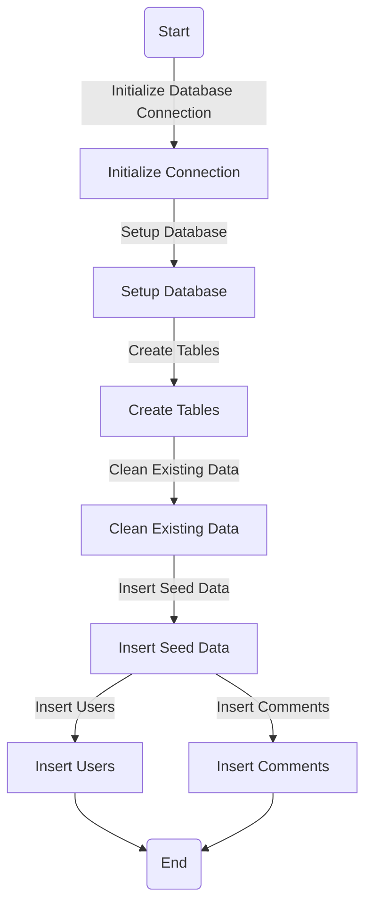
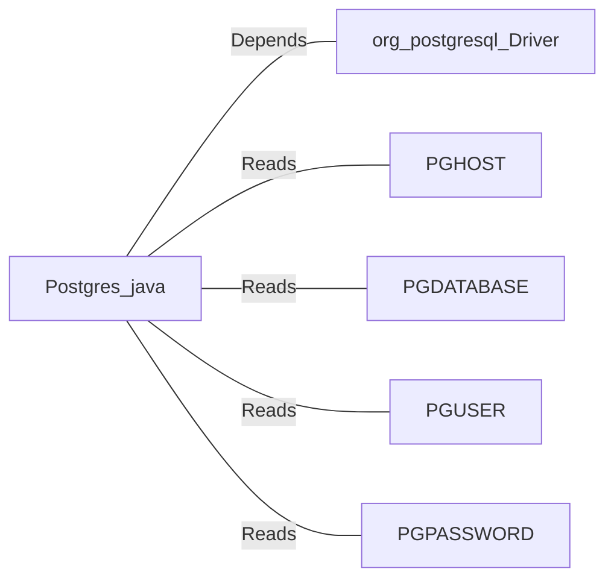

# Postgres.java: Database Setup and Seed Data Management

## Overview

This Java program is responsible for setting up a PostgreSQL database schema, seeding it with initial data, and providing utility methods for database interaction. It includes functionality for creating tables, inserting user and comment data, and hashing passwords using the MD5 algorithm.

## Process Flow

```mermaid
flowchart TD
    Start("Start") --> |"Initialize Database Connection"| InitConnection["Initialize Connection"]
    InitConnection --> |"Setup Database"| SetupDB["Setup Database"]
    SetupDB --> |"Create Tables"| CreateTables["Create Tables"]
    CreateTables --> |"Clean Existing Data"| CleanData["Clean Existing Data"]
    CleanData --> |"Insert Seed Data"| InsertSeedData["Insert Seed Data"]
    InsertSeedData --> |"Insert Users"| InsertUsers["Insert Users"]
    InsertSeedData --> |"Insert Comments"| InsertComments["Insert Comments"]
    InsertUsers --> End("End")
    InsertComments --> End
```

## Insights

- **Database Connection**: The program establishes a connection to a PostgreSQL database using environment variables for configuration (`PGHOST`, `PGDATABASE`, `PGUSER`, `PGPASSWORD`).
- **Schema Creation**: Two tables are created:
  - `users`: Stores user information, including hashed passwords.
  - `comments`: Stores user comments.
- **Data Seeding**: The program inserts predefined users and comments into the database.
- **Password Hashing**: User passwords are hashed using the MD5 algorithm before being stored in the database.
- **Error Handling**: Basic error handling is implemented, but it primarily prints stack traces and exits the program on failure.
- **UUID Usage**: Unique identifiers for users and comments are generated using `UUID.randomUUID()`.

## Vulnerabilities

1. **MD5 for Password Hashing**:
   - MD5 is considered cryptographically insecure and should not be used for password hashing. A more secure algorithm like bcrypt, Argon2, or PBKDF2 should be used.

2. **Hardcoded Seed Data**:
   - The program includes hardcoded usernames and passwords, which could lead to security risks if used in production.

3. **Environment Variable Exposure**:
   - The program relies on environment variables for database credentials. If these variables are not securely managed, they could be exposed.

4. **Lack of Input Validation**:
   - The program does not validate user input when inserting comments, which could lead to SQL injection or other vulnerabilities if the SQL statements are not properly parameterized.

5. **Error Handling**:
   - The program prints stack traces and exits on errors, which could expose sensitive information in a production environment.

6. **No SSL for Database Connection**:
   - The database connection does not enforce SSL, which could lead to data interception during transmission.

## Dependencies

```mermaid
flowchart LR
    Postgres_java --- |"Depends"| org_postgresql_Driver
    Postgres_java --- |"Reads"| PGHOST
    Postgres_java --- |"Reads"| PGDATABASE
    Postgres_java --- |"Reads"| PGUSER
    Postgres_java --- |"Reads"| PGPASSWORD
```

- `org.postgresql.Driver`: Used to establish a connection to the PostgreSQL database.
- `PGHOST`: Environment variable for the database host.
- `PGDATABASE`: Environment variable for the database name.
- `PGUSER`: Environment variable for the database user.
- `PGPASSWORD`: Environment variable for the database password.

## Data Manipulation (SQL)

### Table Structures

#### `users`
| Attribute    | Type         | Description                              |
|--------------|--------------|------------------------------------------|
| `user_id`    | VARCHAR(36)  | Primary key, unique identifier for users |
| `username`   | VARCHAR(50)  | Unique username, not null                |
| `password`   | VARCHAR(50)  | Hashed password, not null                |
| `created_on` | TIMESTAMP    | Timestamp of user creation               |
| `last_login` | TIMESTAMP    | Timestamp of last login                  |

#### `comments`
| Attribute    | Type         | Description                              |
|--------------|--------------|------------------------------------------|
| `id`         | VARCHAR(36)  | Primary key, unique identifier for comments |
| `username`   | VARCHAR(36)  | Username of the commenter                |
| `body`       | VARCHAR(500) | Comment text                             |
| `created_on` | TIMESTAMP    | Timestamp of comment creation            |

### SQL Operations

- **`CREATE TABLE`**: Creates the `users` and `comments` tables if they do not already exist.
- **`DELETE`**: Cleans up existing data in the `users` and `comments` tables.
- **`INSERT`**: Inserts seed data into the `users` and `comments` tables.
