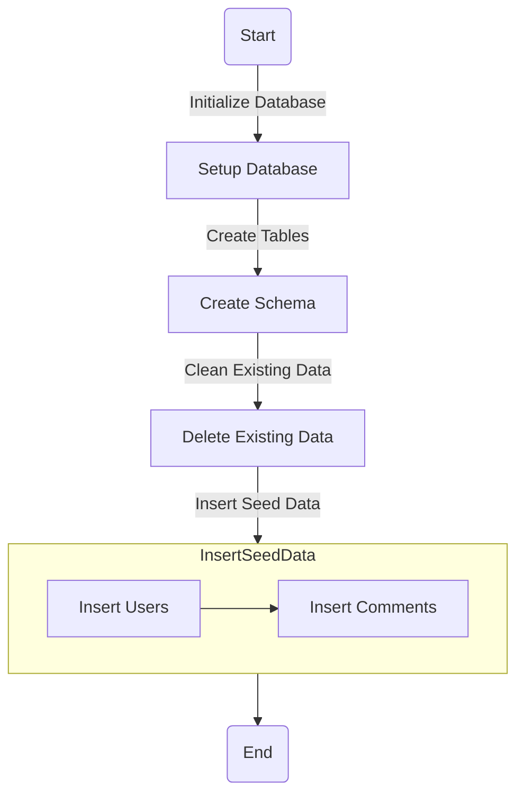
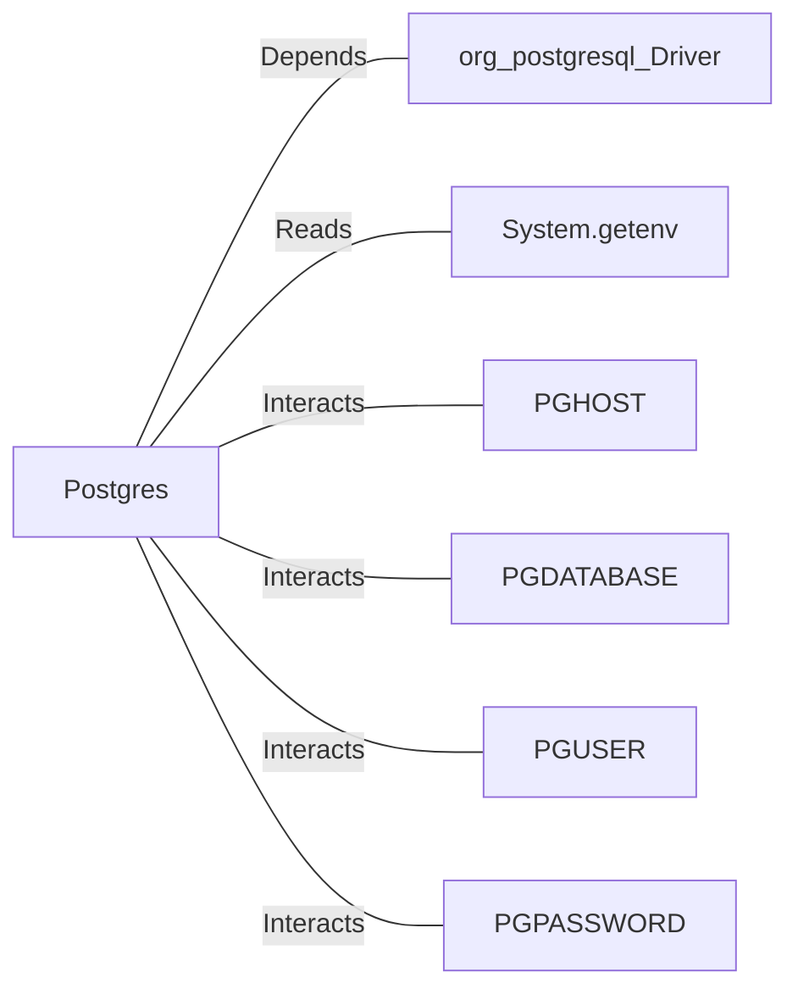

# Postgres.java: Database Setup and Seed Data Management

## Overview

This program is responsible for setting up a PostgreSQL database schema, seeding it with initial data, and providing utility methods for database interaction. It includes functionality for creating tables, inserting users and comments, and hashing passwords using the MD5 algorithm.

## Process Flow

```mermaid
flowchart TD
    Start("Start") --> |"Initialize Database"| SetupDB["Setup Database"]
    SetupDB --> |"Create Tables"| CreateTables["Create Schema"]
    CreateTables --> |"Clean Existing Data"| CleanData["Delete Existing Data"]
    CleanData --> |"Insert Seed Data"| InsertSeedData["Insert Users and Comments"]
    InsertSeedData --> End("End")
    
    subgraph InsertSeedData
        InsertUsers["Insert Users"] --> InsertComments["Insert Comments"]
    end
```

## Insights

- **Database Connection**: The `connection()` method establishes a connection to a PostgreSQL database using environment variables for configuration.
- **Schema Creation**: The `setup()` method creates two tables (`users` and `comments`) if they do not already exist.
- **Data Seeding**: The `setup()` method inserts predefined users and comments into the database.
- **Password Hashing**: The `md5()` method hashes passwords using the MD5 algorithm before storing them in the database.
- **UUID Usage**: Unique identifiers for users and comments are generated using `UUID.randomUUID()`.
- **Prepared Statements**: SQL queries for inserting data use `PreparedStatement` to prevent SQL injection.

## Dependencies

```mermaid
flowchart LR
    Postgres --- |"Depends"| org_postgresql_Driver
    Postgres --- |"Reads"| System.getenv
    Postgres --- |"Interacts"| PGHOST
    Postgres --- |"Interacts"| PGDATABASE
    Postgres --- |"Interacts"| PGUSER
    Postgres --- |"Interacts"| PGPASSWORD
```

- `org.postgresql.Driver`: Required for connecting to the PostgreSQL database.
- `System.getenv`: Reads environment variables for database configuration.
- `PGHOST`, `PGDATABASE`, `PGUSER`, `PGPASSWORD`: Environment variables used for database connection.

## Data Manipulation (SQL)

### Table Structures

#### `users`
| Attribute    | Type         | Description                                      |
|--------------|--------------|--------------------------------------------------|
| `user_id`    | VARCHAR(36)  | Primary key, unique identifier for the user.     |
| `username`   | VARCHAR(50)  | Unique username for the user.                    |
| `password`   | VARCHAR(50)  | MD5-hashed password.                             |
| `created_on` | TIMESTAMP    | Timestamp of user creation.                      |
| `last_login` | TIMESTAMP    | Timestamp of the last login (nullable).          |

#### `comments`
| Attribute    | Type         | Description                                      |
|--------------|--------------|--------------------------------------------------|
| `id`         | VARCHAR(36)  | Primary key, unique identifier for the comment.  |
| `username`   | VARCHAR(36)  | Username of the comment author.                  |
| `body`       | VARCHAR(500) | Content of the comment.                          |
| `created_on` | TIMESTAMP    | Timestamp of comment creation.                   |

### SQL Operations

- **`CREATE TABLE`**: Creates `users` and `comments` tables if they do not exist.
- **`DELETE`**: Removes all existing data from `users` and `comments` tables.
- **`INSERT`**: Adds new users and comments to the respective tables.

## Vulnerabilities

1. **MD5 for Password Hashing**:
   - MD5 is considered cryptographically insecure and should not be used for password hashing. A stronger algorithm like bcrypt, Argon2, or PBKDF2 is recommended.

2. **Environment Variable Exposure**:
   - Sensitive information such as database credentials is retrieved from environment variables. Ensure these variables are securely managed and not exposed.

3. **Error Handling**:
   - Exceptions are printed to the console, which may expose sensitive information. Consider logging errors securely and avoiding direct output to the console.

4. **Hardcoded Seed Data**:
   - The seed data includes hardcoded usernames and passwords, which could be a security risk if used in production.

5. **Lack of Input Validation**:
   - The program does not validate input data for `username` and `body` fields, which could lead to potential issues like SQL injection or data corruption.
