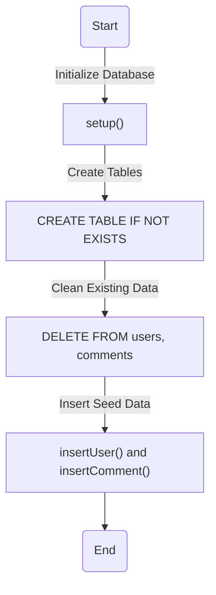
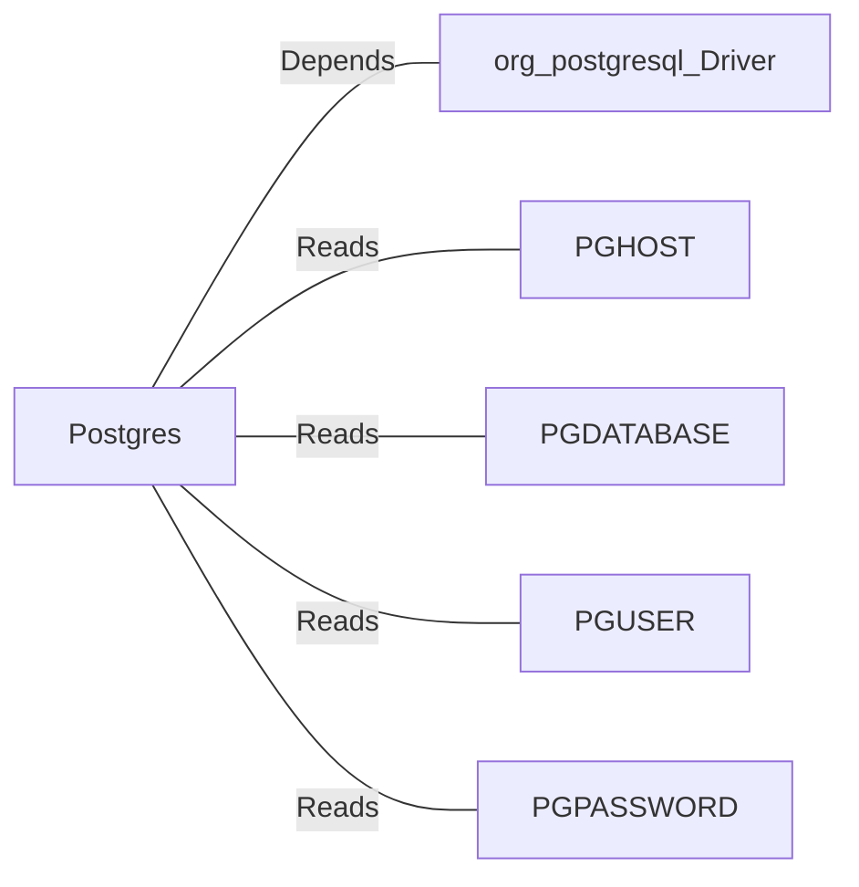

# Postgres.java: Database Setup and Utility Class for PostgreSQL

## Overview

This Java class, `Postgres`, is responsible for managing a PostgreSQL database connection, setting up the database schema, and seeding it with initial data. It also provides utility methods for hashing passwords using MD5 and inserting user and comment records into the database.

## Process Flow

```mermaid
flowchart TD
    Start("Start") --> |"Initialize Database"| Setup["setup()"]
    Setup --> |"Create Tables"| CreateTables["CREATE TABLE IF NOT EXISTS"]
    CreateTables --> |"Clean Existing Data"| CleanData["DELETE FROM users, comments"]
    CleanData --> |"Insert Seed Data"| SeedData["insertUser() and insertComment()"]
    SeedData --> End("End")
```

## Insights

- **Database Connection**: The `connection()` method establishes a connection to a PostgreSQL database using environment variables for configuration.
- **Schema Setup**: The `setup()` method creates two tables (`users` and `comments`) if they do not already exist and clears any existing data.
- **Password Hashing**: The `md5()` method hashes passwords using the MD5 algorithm, which is considered insecure for password storage.
- **Data Seeding**: The `setup()` method seeds the database with predefined users and comments.
- **Prepared Statements**: The `insertUser()` and `insertComment()` methods use prepared statements to prevent SQL injection.

## Vulnerabilities

1. **Insecure Password Hashing**:
   - The `md5()` method is used to hash passwords. MD5 is considered cryptographically broken and unsuitable for further use. A more secure hashing algorithm like bcrypt or Argon2 should be used.

2. **Hardcoded Seed Data**:
   - The `setup()` method includes hardcoded usernames and passwords, which could lead to security risks if used in a production environment.

3. **Error Handling**:
   - Exceptions are caught and printed using `e.printStackTrace()`, which may expose sensitive information in logs. Proper logging mechanisms should be used.

4. **Environment Variable Dependency**:
   - The database connection relies on environment variables (`PGHOST`, `PGDATABASE`, `PGUSER`, `PGPASSWORD`). If these are not set correctly, the application will fail.

5. **Potential Resource Leaks**:
   - The `PreparedStatement` and `Connection` objects are not explicitly closed, which could lead to resource leaks.

## Dependencies

```mermaid
flowchart LR
    Postgres --- |"Depends"| org_postgresql_Driver
    Postgres --- |"Reads"| PGHOST
    Postgres --- |"Reads"| PGDATABASE
    Postgres --- |"Reads"| PGUSER
    Postgres --- |"Reads"| PGPASSWORD
```

- `org_postgresql_Driver`: PostgreSQL JDBC driver used for database connectivity.
- `PGHOST`: Environment variable for the database host.
- `PGDATABASE`: Environment variable for the database name.
- `PGUSER`: Environment variable for the database user.
- `PGPASSWORD`: Environment variable for the database password.

## Data Manipulation (SQL)

### Table Structures

#### `users`
| Attribute    | Type         | Description                                      |
|--------------|--------------|--------------------------------------------------|
| `user_id`    | VARCHAR(36)  | Primary key, unique identifier for the user.     |
| `username`   | VARCHAR(50)  | Unique username, cannot be null.                 |
| `password`   | VARCHAR(50)  | MD5-hashed password, cannot be null.             |
| `created_on` | TIMESTAMP    | Timestamp of user creation.                      |
| `last_login` | TIMESTAMP    | Timestamp of the last login.                     |

#### `comments`
| Attribute    | Type         | Description                                      |
|--------------|--------------|--------------------------------------------------|
| `id`         | VARCHAR(36)  | Primary key, unique identifier for the comment.  |
| `username`   | VARCHAR(36)  | Username of the commenter.                       |
| `body`       | VARCHAR(500) | Content of the comment.                          |
| `created_on` | TIMESTAMP    | Timestamp of comment creation.                   |

### SQL Operations

- **CREATE TABLE**: Creates `users` and `comments` tables if they do not exist.
- **DELETE**: Clears all data from `users` and `comments` tables.
- **INSERT**: Adds new records to `users` and `comments` tables.
