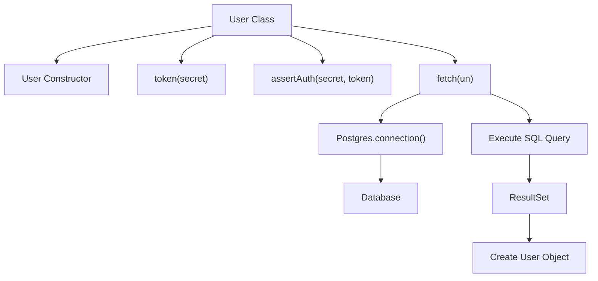
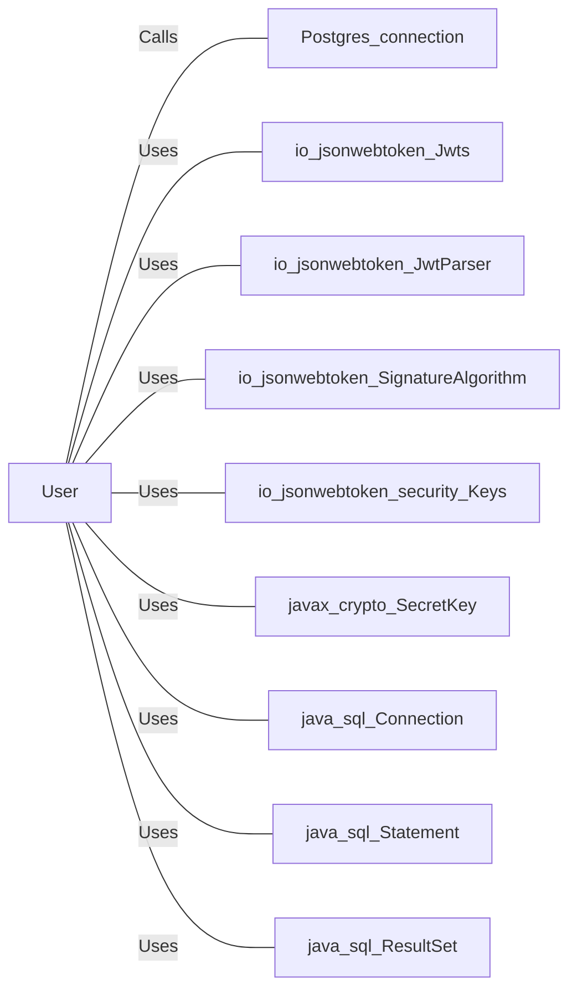

# User.java: User Management and Authentication

## Overview
The `User` class is responsible for managing user information and handling authentication processes. It includes methods for generating JWT tokens, asserting authentication, and fetching user details from a database.

## Process Flow

## Insights
- The `User` class includes attributes for `id`, `username`, and `hashedPassword`.
- The `token` method generates a JWT token using the provided secret key.
- The `assertAuth` method validates the provided JWT token using the secret key.
- The `fetch` method retrieves user details from the database based on the username.

## Dependencies

- `Postgres_connection`: Establishes a connection to the PostgreSQL database.
- `io_jsonwebtoken_Jwts`: Used for building and parsing JWT tokens.
- `io_jsonwebtoken_JwtParser`: Used for parsing JWT tokens.
- `io_jsonwebtoken_SignatureAlgorithm`: Used for specifying the signature algorithm for JWT tokens.
- `io_jsonwebtoken_security_Keys`: Used for generating secret keys for JWT tokens.
- `javax_crypto_SecretKey`: Represents the secret key used for signing JWT tokens.
- `java_sql_Connection`: Represents a connection to the database.
- `java_sql_Statement`: Used for executing SQL queries.
- `java_sql_ResultSet`: Represents the result set of a SQL query.

## Data Manipulation (SQL)
### Table: users
| Attribute  | Type   | Description                  |
|------------|--------|------------------------------|
| user_id    | String | Unique identifier for the user|
| username   | String | Username of the user         |
| password   | String | Hashed password of the user  |

- `users`: Fetches user details based on the username. The SQL operation performed is `SELECT`.
