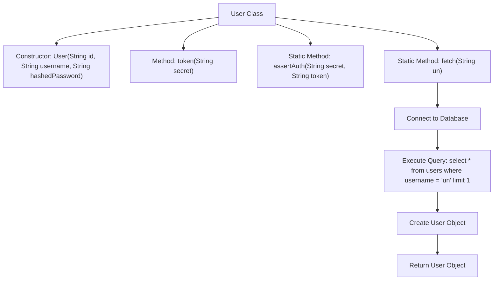
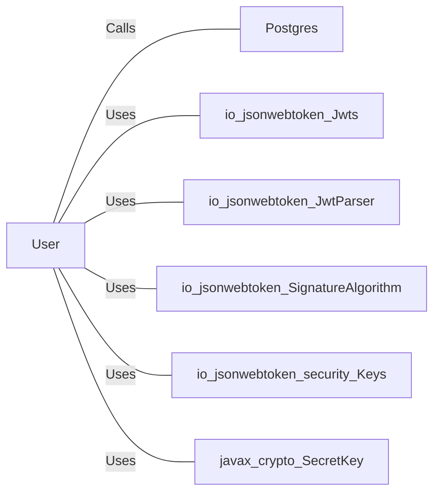

# User.java: User Management and Authentication

## Overview
The `User` class is responsible for managing user information and handling authentication using JSON Web Tokens (JWT). It includes methods for generating tokens, asserting authentication, and fetching user details from a database.

## Process Flow

## Insights
- The `User` class handles user-related operations such as token generation and authentication.
- The `token` method generates a JWT for the user using a provided secret key.
- The `assertAuth` method verifies the provided JWT using the secret key.
- The `fetch` method retrieves user details from a PostgreSQL database based on the username.

## Dependencies

- `Postgres`: Used to establish a connection to the PostgreSQL database.
- `io.jsonwebtoken.Jwts`: Used for building and parsing JWTs.
- `io.jsonwebtoken.JwtParser`: Used for parsing JWTs.
- `io.jsonwebtoken.SignatureAlgorithm`: Used for specifying the signature algorithm for JWTs.
- `io.jsonwebtoken.security.Keys`: Used for generating secret keys for JWTs.
- `javax.crypto.SecretKey`: Represents the secret key used for signing JWTs.

## Data Manipulation (SQL)
| Attribute     | Type   | Description                        |
|---------------|--------|------------------------------------|
| user_id       | String | Unique identifier for the user     |
| username      | String | Username of the user               |
| password      | String | Hashed password of the user        |

- `users`: Table containing user details.
  - `SELECT`: Retrieves user details based on the username.

## Vulnerabilities
- **SQL Injection**: The `fetch` method constructs the SQL query using string concatenation, which makes it vulnerable to SQL injection attacks. It is recommended to use prepared statements to mitigate this risk.
- **Exception Handling**: The `assertAuth` method catches all exceptions and throws a custom `Unauthorized` exception. This could potentially expose sensitive information. It is advisable to handle specific exceptions and provide generic error messages.
- **Resource Management**: The `fetch` method does not properly close the `Statement` and `ResultSet` objects, which could lead to resource leaks. It is recommended to use try-with-resources for managing these resources.
