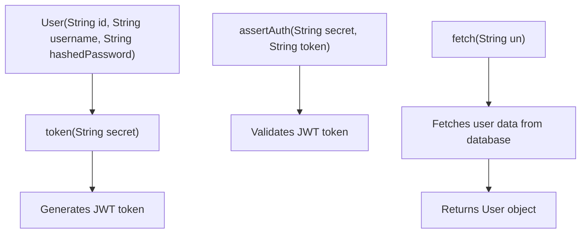
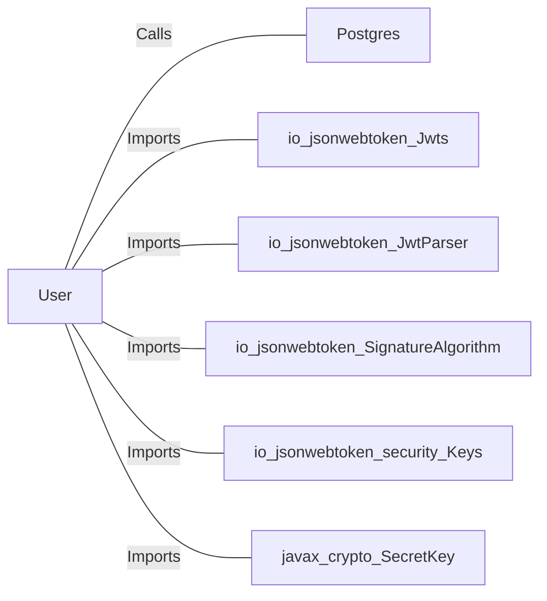

# User.java: User Management and Authentication

## Overview
This class is responsible for managing user data and handling authentication processes. It includes methods for generating JWT tokens, validating tokens, and fetching user data from a database.

## Process Flow

## Insights
- The `User` class includes methods for generating and validating JWT tokens.
- The `fetch` method retrieves user data from a PostgreSQL database.
- The `assertAuth` method validates the provided JWT token using the secret key.
- The `fetch` method constructs SQL queries using string concatenation, which can lead to SQL injection vulnerabilities.

## Dependencies

- `Postgres`: Provides a connection to the PostgreSQL database.
- `io_jsonwebtoken_Jwts`: Used for creating and parsing JWT tokens.
- `io_jsonwebtoken_JwtParser`: Used for parsing JWT tokens.
- `io_jsonwebtoken_SignatureAlgorithm`: Used for specifying the signature algorithm for JWT tokens.
- `io_jsonwebtoken_security_Keys`: Used for generating secret keys for JWT tokens.
- `javax_crypto_SecretKey`: Represents the secret key used for signing JWT tokens.

## Data Manipulation (SQL)
- `users`: The `fetch` method performs a SELECT operation to retrieve user data based on the username.

### Table: users
| Attribute  | Type   | Description                  |
|------------|--------|------------------------------|
| user_id    | String | Unique identifier for the user|
| username   | String | Username of the user         |
| password   | String | Hashed password of the user  |

## Vulnerabilities
- **SQL Injection**: The `fetch` method constructs SQL queries using string concatenation, which can be exploited for SQL injection attacks. It is recommended to use prepared statements to mitigate this risk.
- **Exception Handling**: The `assertAuth` method catches all exceptions and throws a custom `Unauthorized` exception without distinguishing between different types of errors. This can make debugging difficult and may mask underlying issues.
