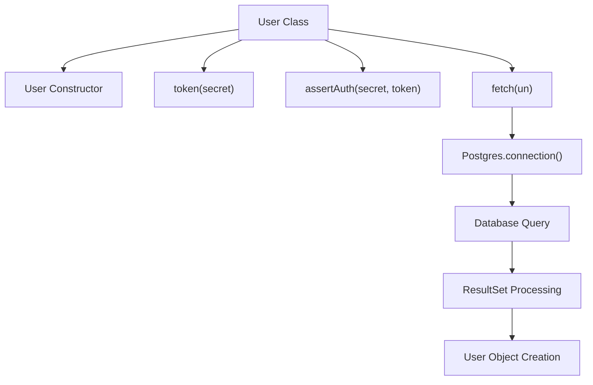
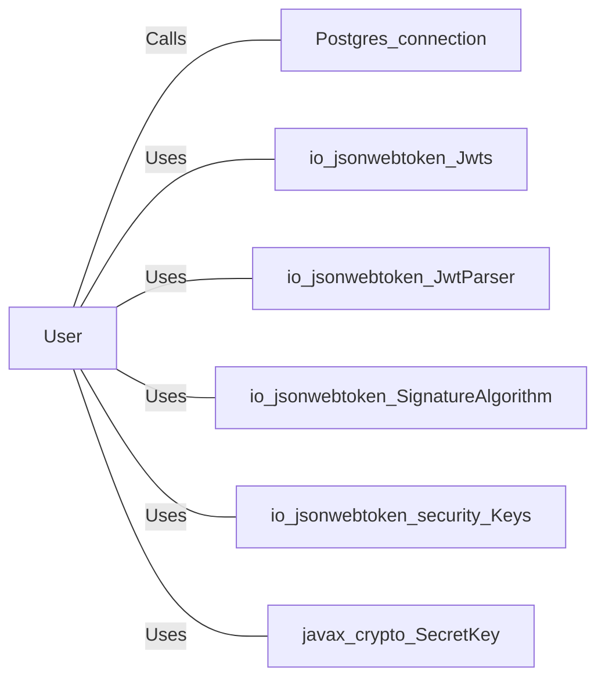

# User.java: User Management and Authentication

## Overview
The `User` class is responsible for managing user information and handling authentication processes. It includes methods for generating JWT tokens, asserting authentication, and fetching user details from a database.

## Process Flow

```mermaid
flowchart TD
    A["User Class"] --> B["User Constructor"]
    A --> C["token(secret)"]
    A --> D["assertAuth(secret, token)"]
    A --> E["fetch(un)"]
    E --> F["Postgres.connection()"]
    F --> G["Database Query"]
    G --> H["ResultSet Processing"]
    H --> I["User Object Creation"]
```

## Insights
- The `User` class includes attributes for `id`, `username`, and `hashedPassword`.
- The `token` method generates a JWT token using the provided secret key.
- The `assertAuth` method validates the provided JWT token using the secret key.
- The `fetch` method retrieves user details from the database based on the username.

## Dependencies

```mermaid
flowchart LR
    User --- |"Calls"| Postgres_connection
    User --- |"Uses"| io_jsonwebtoken_Jwts
    User --- |"Uses"| io_jsonwebtoken_JwtParser
    User --- |"Uses"| io_jsonwebtoken_SignatureAlgorithm
    User --- |"Uses"| io_jsonwebtoken_security_Keys
    User --- |"Uses"| javax_crypto_SecretKey
```

- `Postgres.connection`: Establishes a connection to the PostgreSQL database.
- `io.jsonwebtoken.Jwts`: Used for building and parsing JWT tokens.
- `io.jsonwebtoken.JwtParser`: Used for parsing JWT tokens.
- `io.jsonwebtoken.SignatureAlgorithm`: Specifies the algorithm for signing JWT tokens.
- `io.jsonwebtoken.security.Keys`: Provides methods for generating secret keys.
- `javax.crypto.SecretKey`: Represents the secret key used for signing JWT tokens.

## Data Manipulation (SQL)
### Table: users
| Attribute  | Type   | Description                  |
|------------|--------|------------------------------|
| user_id    | String | Unique identifier for the user|
| username   | String | Username of the user         |
| password   | String | Hashed password of the user  |

- The `fetch` method performs a `SELECT` operation to retrieve user details from the `users` table based on the username.

## Vulnerabilities
- **SQL Injection**: The `fetch` method constructs the SQL query using string concatenation, which is vulnerable to SQL injection attacks. It is recommended to use prepared statements to mitigate this risk.
- **Sensitive Data Exposure**: The `fetch` method prints the SQL query to the console, which may expose sensitive information. It is recommended to remove or sanitize such logging.
- **Exception Handling**: The `assertAuth` method catches all exceptions and throws a custom `Unauthorized` exception. It is recommended to handle specific exceptions to provide more meaningful error messages.
