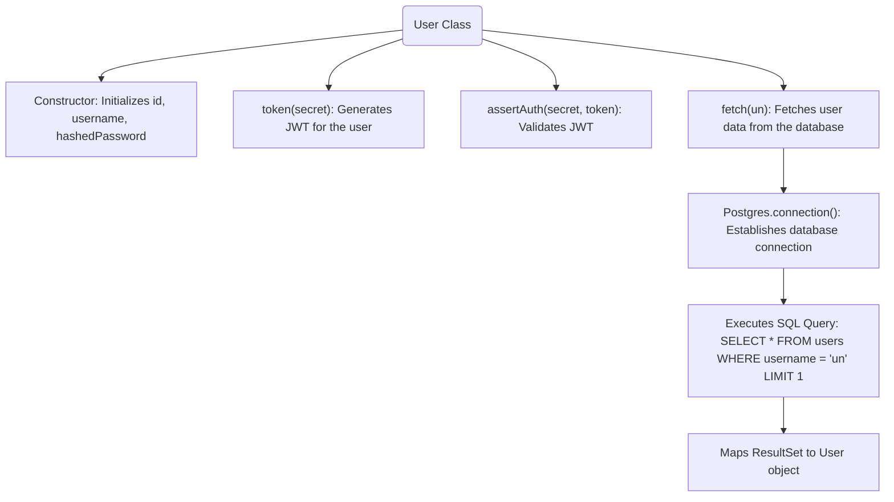
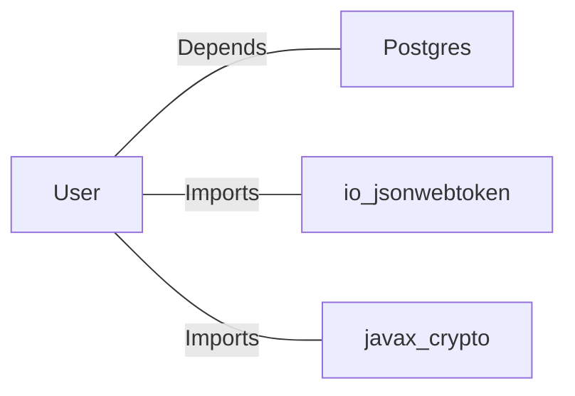

# User.java: User Management and Authentication

## Overview

This class provides functionalities for user management and authentication. It includes methods for generating JSON Web Tokens (JWT), validating tokens, and fetching user data from a database. The class also demonstrates the use of cryptographic keys for signing tokens and interacts with a PostgreSQL database to retrieve user information.

## Process Flow

```mermaid
flowchart TD
    A("User Class") --> B["Constructor: Initializes id, username, hashedPassword"]
    A --> C["token(secret): Generates JWT for the user"]
    A --> D["assertAuth(secret, token): Validates JWT"]
    A --> E["fetch(un): Fetches user data from the database"]
    E --> F["Postgres.connection(): Establishes database connection"]
    F --> G["Executes SQL Query: SELECT * FROM users WHERE username = 'un' LIMIT 1"]
    G --> H["Maps ResultSet to User object"]
```

## Insights

- **JWT Generation**: The `token` method generates a JWT for the user using a secret key. The token is signed with the HMAC SHA algorithm.
- **JWT Validation**: The `assertAuth` method validates the provided JWT using the same secret key.
- **Database Interaction**: The `fetch` method retrieves user data from a PostgreSQL database using a raw SQL query.
- **Potential SQL Injection**: The `fetch` method constructs the SQL query by directly concatenating the `username` parameter, making it vulnerable to SQL injection attacks.
- **Error Handling**: The `assertAuth` method throws a custom `Unauthorized` exception if token validation fails. The `fetch` method logs errors but does not rethrow them, which may lead to silent failures.
- **Cryptographic Key Management**: The secret key is derived from the provided string, but no mechanism is in place to securely manage or rotate the key.

## Dependencies

```mermaid
flowchart LR
    User --- |"Depends"| Postgres
    User --- |"Imports"| io_jsonwebtoken
    User --- |"Imports"| javax_crypto
```

- `Postgres`: Provides the `connection()` method to establish a connection to the PostgreSQL database.
- `io.jsonwebtoken`: Used for creating and parsing JSON Web Tokens (JWT).
- `javax.crypto`: Used for cryptographic operations, specifically for generating HMAC SHA keys.

## Data Manipulation (SQL)

### Table: `users`

| Attribute   | Type   | Description                          |
|-------------|--------|--------------------------------------|
| `user_id`   | String | Unique identifier for the user.      |
| `username`  | String | Username of the user.                |
| `password`  | String | Hashed password of the user.         |

### SQL Query

- **Query**: `SELECT * FROM users WHERE username = 'un' LIMIT 1`
- **Operation**: SELECT
- **Purpose**: Fetches a single user record based on the provided username.

## Vulnerabilities

### 1. SQL Injection
- **Issue**: The `fetch` method constructs the SQL query by directly concatenating the `username` parameter, making it vulnerable to SQL injection.
- **Impact**: An attacker could manipulate the `username` input to execute arbitrary SQL commands, potentially exposing sensitive data or compromising the database.
- **Mitigation**: Use prepared statements or parameterized queries to prevent SQL injection.

### 2. Weak Key Management
- **Issue**: The secret key for signing and validating JWTs is derived from a string without any secure key management practices.
- **Impact**: If the secret key is exposed or predictable, it compromises the security of the JWTs.
- **Mitigation**: Use a secure key management system to store and rotate keys.

### 3. Inadequate Error Handling
- **Issue**: The `fetch` method logs errors but does not rethrow them, potentially leading to silent failures.
- **Impact**: Debugging and error tracking become difficult, and the application may behave unpredictably.
- **Mitigation**: Implement proper error handling and consider rethrowing exceptions or returning meaningful error messages.

### 4. Token Validation Exception Handling
- **Issue**: The `assertAuth` method catches all exceptions and throws a custom `Unauthorized` exception without differentiating between error types.
- **Impact**: It becomes harder to debug specific issues related to token validation.
- **Mitigation**: Handle specific exceptions (e.g., expired token, invalid signature) separately to provide more granular error messages.
