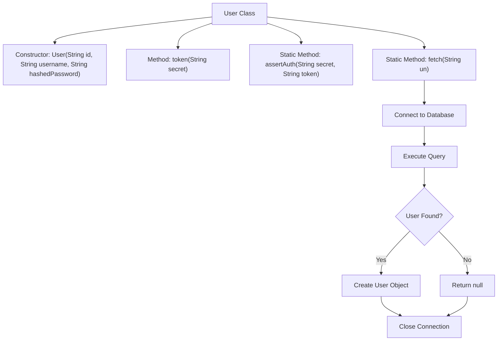
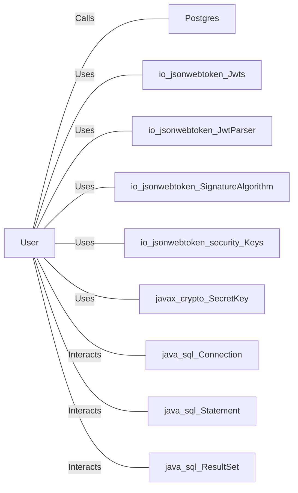

# User.java: User Management and Authentication

## Overview
The `User` class is responsible for managing user information, generating authentication tokens, and validating these tokens. It also includes functionality to fetch user details from a database.

## Process Flow

```mermaid
flowchart TD
    A["User Class"] --> B["Constructor: User(String id, String username, String hashedPassword)"]
    A --> C["Method: token(String secret)"]
    A --> D["Static Method: assertAuth(String secret, String token)"]
    A --> E["Static Method: fetch(String un)"]
    E --> F["Connect to Database"]
    F --> G["Execute Query"]
    G --> H{"User Found?"}
    H --> |Yes| I["Create User Object"]
    H --> |No| J["Return null"]
    I --> K["Close Connection"]
    J --> K
```

## Insights
- The `User` class includes methods for generating and validating JWT tokens.
- The `fetch` method retrieves user details from a PostgreSQL database based on the username.
- The `token` method generates a JWT token using the provided secret key.
- The `assertAuth` method validates the provided JWT token using the secret key.

## Dependencies

```mermaid
flowchart LR
    User --- |"Calls"| Postgres
    User --- |"Uses"| io_jsonwebtoken_Jwts
    User --- |"Uses"| io_jsonwebtoken_JwtParser
    User --- |"Uses"| io_jsonwebtoken_SignatureAlgorithm
    User --- |"Uses"| io_jsonwebtoken_security_Keys
    User --- |"Uses"| javax_crypto_SecretKey
    User --- |"Interacts"| java_sql_Connection
    User --- |"Interacts"| java_sql_Statement
    User --- |"Interacts"| java_sql_ResultSet
```

- `Postgres`: Used to establish a connection to the PostgreSQL database.
- `io.jsonwebtoken.Jwts`: Used for creating and parsing JWT tokens.
- `io.jsonwebtoken.JwtParser`: Used for parsing JWT tokens.
- `io.jsonwebtoken.SignatureAlgorithm`: Used for specifying the signature algorithm for JWT tokens.
- `io.jsonwebtoken.security.Keys`: Used for generating secret keys for JWT tokens.
- `javax.crypto.SecretKey`: Represents the secret key used for signing JWT tokens.
- `java.sql.Connection`: Represents a connection to the database.
- `java.sql.Statement`: Used for executing SQL statements.
- `java.sql.ResultSet`: Represents the result set of a SQL query.

## Data Manipulation (SQL)
- `users`: The table queried to fetch user details based on the username.
  - Attributes:
    - `user_id` (String): The unique identifier for the user.
    - `username` (String): The username of the user.
    - `password` (String): The hashed password of the user.

## Vulnerabilities
- **SQL Injection**: The `fetch` method constructs the SQL query using string concatenation, which makes it vulnerable to SQL injection attacks. It is recommended to use prepared statements to mitigate this risk.
- **Exception Handling**: The `assertAuth` method catches all exceptions and throws a custom `Unauthorized` exception without distinguishing between different types of errors. This can make debugging difficult and may mask underlying issues.
- **Resource Management**: The `fetch` method does not properly close the `Statement` object, which can lead to resource leaks. It is recommended to use a `try-with-resources` statement to ensure that resources are properly closed.
