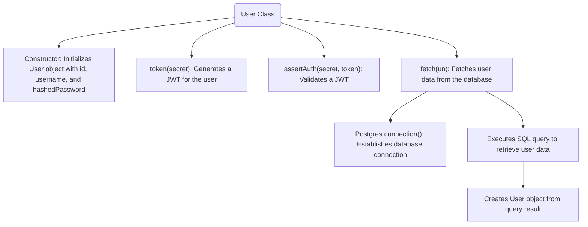
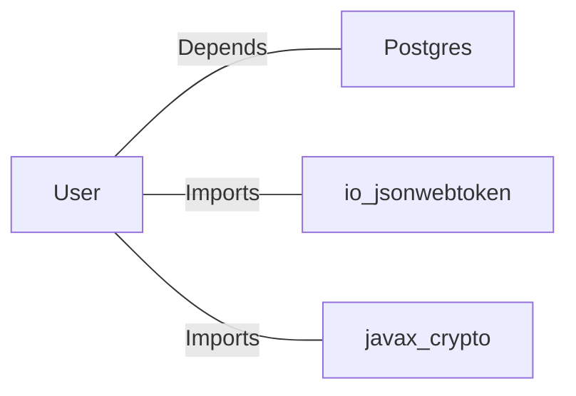

# User.java: User Management and Authentication

## Overview

This class provides functionalities for user management and authentication. It includes methods for generating JSON Web Tokens (JWT), validating tokens, and fetching user data from a database. The class also demonstrates the use of cryptographic keys for signing tokens and interacts with a PostgreSQL database to retrieve user information.

## Process Flow

```mermaid
flowchart TD
    A("User Class") --> B["Constructor: Initializes User object with id, username, and hashedPassword"]
    A --> C["token(secret): Generates a JWT for the user"]
    A --> D["assertAuth(secret, token): Validates a JWT"]
    A --> E["fetch(un): Fetches user data from the database"]
    E --> F["Postgres.connection(): Establishes database connection"]
    E --> G["Executes SQL query to retrieve user data"]
    G --> H["Creates User object from query result"]
```

## Insights

- **JWT Generation**: The `token` method generates a JWT using the user's username as the subject and signs it with a secret key.
- **JWT Validation**: The `assertAuth` method validates a JWT using the provided secret key. If validation fails, it throws an `Unauthorized` exception.
- **Database Interaction**: The `fetch` method retrieves user data from a PostgreSQL database using a raw SQL query.
- **Potential SQL Injection**: The `fetch` method constructs the SQL query by directly concatenating the `username` parameter, making it vulnerable to SQL injection attacks.
- **Error Handling**: The `fetch` method logs errors to the console but does not rethrow them, potentially masking issues during execution.

## Dependencies

```mermaid
flowchart LR
    User --- |"Depends"| Postgres
    User --- |"Imports"| io_jsonwebtoken
    User --- |"Imports"| javax_crypto
```

- `Postgres`: Provides the `connection()` method to establish a connection to the PostgreSQL database.
- `io.jsonwebtoken`: Used for creating and parsing JSON Web Tokens (JWT).
- `javax.crypto`: Used for cryptographic operations, such as generating secret keys.

## Vulnerabilities

1. **SQL Injection**:
   - The `fetch` method constructs the SQL query by directly concatenating the `username` parameter, making it vulnerable to SQL injection attacks.
   - **Mitigation**: Use prepared statements or parameterized queries to prevent SQL injection.

2. **Hardcoded Secret Key**:
   - The `token` and `assertAuth` methods rely on a secret key passed as a string. If the secret is not securely managed, it could lead to token forgery.
   - **Mitigation**: Use a secure key management system to store and retrieve the secret key.

3. **Improper Error Handling**:
   - The `fetch` method logs errors to the console but does not rethrow them, potentially masking issues during execution.
   - **Mitigation**: Implement proper error handling and logging mechanisms to ensure issues are appropriately addressed.

4. **Weak Password Storage**:
   - The `hashedPassword` field does not specify the hashing algorithm used. If a weak or outdated algorithm is used, it could compromise password security.
   - **Mitigation**: Use a strong hashing algorithm like bcrypt or Argon2 for password storage.

## Data Manipulation (SQL)

### Table: `users`

| Attribute   | Data Type | Description                          |
|-------------|-----------|--------------------------------------|
| `user_id`   | String    | Unique identifier for the user.      |
| `username`  | String    | Username of the user.                |
| `password`  | String    | Hashed password of the user.         |

### SQL Query

- **Query**: `SELECT * FROM users WHERE username = 'un' LIMIT 1`
- **Operation**: Retrieves a single user record based on the provided username.
