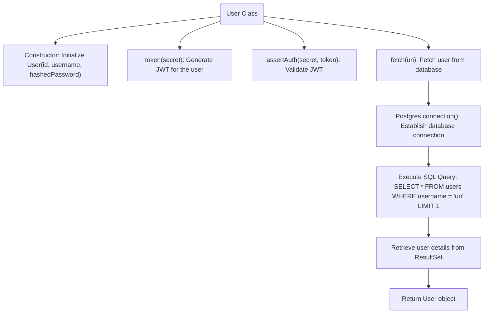
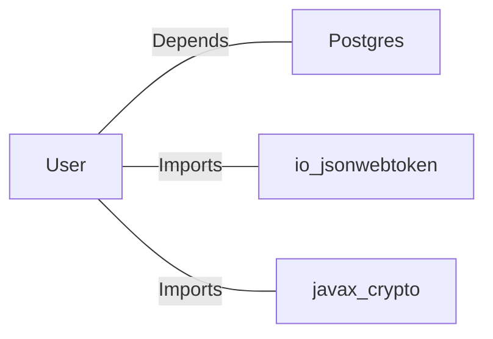

# User.java: User Management and Authentication

## Overview

This class provides functionalities for user management and authentication. It includes methods for generating JSON Web Tokens (JWT), validating tokens, and fetching user data from a database. The class also demonstrates the use of cryptographic keys for signing JWTs and interacts with a PostgreSQL database to retrieve user information.

## Process Flow

```mermaid
flowchart TD
    A("User Class") --> B["Constructor: Initialize User(id, username, hashedPassword)"]
    A --> C["token(secret): Generate JWT for the user"]
    A --> D["assertAuth(secret, token): Validate JWT"]
    A --> E["fetch(un): Fetch user from database"]
    E --> F["Postgres.connection(): Establish database connection"]
    F --> G["Execute SQL Query: SELECT * FROM users WHERE username = 'un' LIMIT 1"]
    G --> H["Retrieve user details from ResultSet"]
    H --> I["Return User object"]
```

## Insights

- The `User` class encapsulates user-related data (`id`, `username`, `hashedPassword`) and provides methods for token generation, authentication, and database retrieval.
- The `token` method generates a JWT for the user using a secret key.
- The `assertAuth` method validates a JWT using the provided secret key and throws an `Unauthorized` exception if validation fails.
- The `fetch` method retrieves user details from a PostgreSQL database based on the username.
- The SQL query in the `fetch` method is vulnerable to SQL injection due to the direct concatenation of user input (`un`) into the query string.

## Vulnerabilities

1. **SQL Injection in `fetch` Method**:
   - The SQL query directly concatenates the `un` parameter, making it susceptible to SQL injection attacks.
   - **Mitigation**: Use prepared statements with parameterized queries to prevent SQL injection.

2. **Hardcoded Secret Key in `token` and `assertAuth` Methods**:
   - The secret key is derived from the `secret` parameter, which may not be securely managed.
   - **Mitigation**: Use a secure key management system to store and retrieve cryptographic keys.

3. **Improper Exception Handling in `assertAuth` Method**:
   - The method catches all exceptions and throws a custom `Unauthorized` exception without differentiating between error types.
   - **Mitigation**: Handle specific exceptions to provide more meaningful error messages and avoid masking critical issues.

4. **Potential Resource Leak in `fetch` Method**:
   - The `Statement` and `Connection` objects are not closed in a `finally` block, which may lead to resource leaks.
   - **Mitigation**: Use a `try-with-resources` statement to ensure proper resource management.

5. **Weak Password Storage**:
   - The `hashedPassword` field does not specify the hashing algorithm or salt usage.
   - **Mitigation**: Use a strong hashing algorithm like bcrypt or Argon2 with proper salting for password storage.

## Dependencies

```mermaid
flowchart LR
    User --- |"Depends"| Postgres
    User --- |"Imports"| io_jsonwebtoken
    User --- |"Imports"| javax_crypto
```

- `Postgres`: Provides the `connection()` method to establish a connection to the PostgreSQL database.
- `io.jsonwebtoken`: Used for creating and parsing JSON Web Tokens (JWT).
- `javax.crypto`: Used for cryptographic operations, such as generating secret keys.

## Data Manipulation (SQL)

### Table: `users`

| Attribute   | Data Type | Description                          |
|-------------|-----------|--------------------------------------|
| `user_id`   | String    | Unique identifier for the user.     |
| `username`  | String    | Username of the user.               |
| `password`  | String    | Hashed password of the user.        |

### SQL Query

- **Query**: `SELECT * FROM users WHERE username = 'un' LIMIT 1`
- **Operation**: Retrieves a single user record based on the provided username.
