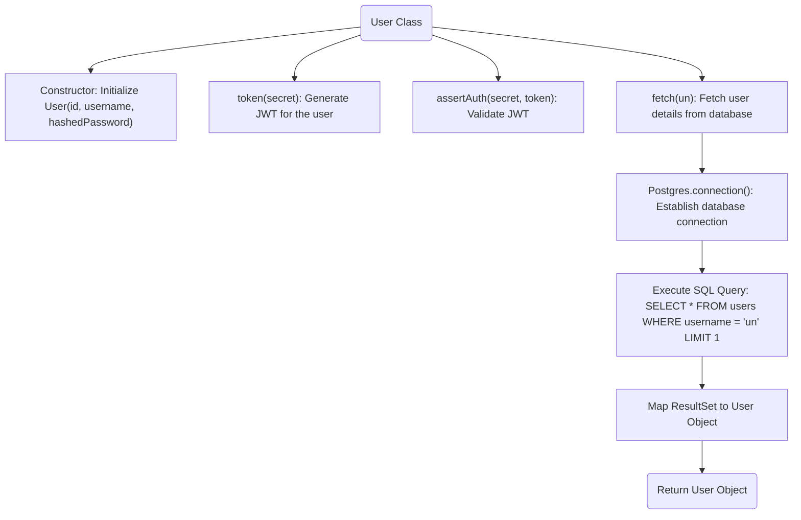
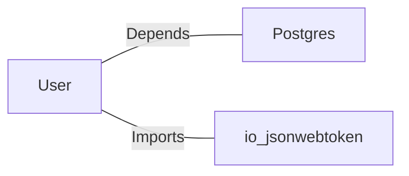

# User.java: User Management and Authentication

## Overview

This class provides functionalities for user management and authentication. It includes methods for generating JSON Web Tokens (JWT), validating tokens, and fetching user details from a database. The class also demonstrates interaction with a PostgreSQL database and the use of the `io.jsonwebtoken` library for JWT operations.

## Process Flow

```mermaid
flowchart TD
    A("User Class") --> B["Constructor: Initialize User(id, username, hashedPassword)"]
    A --> C["token(secret): Generate JWT for the user"]
    A --> D["assertAuth(secret, token): Validate JWT"]
    A --> E["fetch(un): Fetch user details from database"]
    E --> F["Postgres.connection(): Establish database connection"]
    F --> G["Execute SQL Query: SELECT * FROM users WHERE username = 'un' LIMIT 1"]
    G --> H["Map ResultSet to User Object"]
    H --> I("Return User Object")
```

## Insights

- The `User` class encapsulates user-related data (`id`, `username`, `hashedPassword`) and provides methods for token generation, authentication, and database retrieval.
- The `token` method generates a JWT for the user using a secret key.
- The `assertAuth` method validates a JWT using the provided secret key and throws an `Unauthorized` exception if validation fails.
- The `fetch` method retrieves user details from a PostgreSQL database based on the username. It constructs a SQL query dynamically, which introduces potential vulnerabilities.

## Vulnerabilities

1. **SQL Injection in `fetch` Method**:
   - The SQL query in the `fetch` method is constructed using string concatenation, making it vulnerable to SQL injection attacks. An attacker could manipulate the `un` parameter to execute arbitrary SQL commands.
   - **Mitigation**: Use prepared statements with parameterized queries to prevent SQL injection.

2. **Hardcoded Secret Key in `token` and `assertAuth` Methods**:
   - The secret key is derived from the `secret` parameter, which could be insecure if not managed properly.
   - **Mitigation**: Use a secure key management system to store and retrieve the secret key.

3. **Improper Exception Handling in `assertAuth` Method**:
   - The method catches all exceptions and rethrows them as `Unauthorized` without differentiating between error types. This could lead to masking of critical issues.
   - **Mitigation**: Handle specific exceptions and provide meaningful error messages.

4. **Resource Management in `fetch` Method**:
   - The database connection is not properly closed in a `finally` block, which could lead to resource leaks.
   - **Mitigation**: Use a `try-with-resources` statement to ensure the connection is closed properly.

5. **Weak Password Storage**:
   - The `hashedPassword` field does not specify the hashing algorithm or salt usage, which could lead to weak password security.
   - **Mitigation**: Use a strong hashing algorithm like bcrypt or Argon2 with proper salting.

## Dependencies

```mermaid
flowchart LR
    User --- |"Depends"| Postgres
    User --- |"Imports"| io_jsonwebtoken
```

- `Postgres`: Provides the `connection()` method to establish a connection to the PostgreSQL database.
- `io.jsonwebtoken`: Used for JWT creation and validation.

### List of Identified External References

- `Postgres`: Provides the `connection()` method to establish a database connection. Nature: Depends.
- `io.jsonwebtoken`: Library for creating and parsing JSON Web Tokens (JWT). Nature: Imports.

## Data Manipulation (SQL)

### Table: `users`

| Attribute   | Data Type | Description                          |
|-------------|-----------|--------------------------------------|
| `user_id`   | String    | Unique identifier for the user.      |
| `username`  | String    | Username of the user.                |
| `password`  | String    | Hashed password of the user.         |

### SQL Operation

- **Query**: `SELECT * FROM users WHERE username = 'un' LIMIT 1`
  - **Purpose**: Fetch user details based on the provided username.
  - **Operation**: SELECT.
