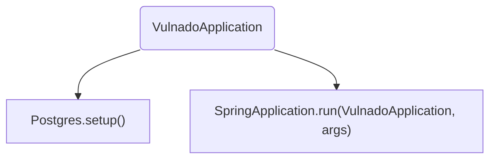
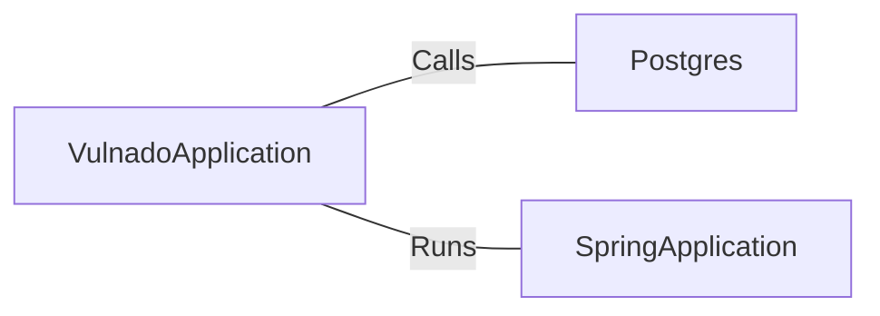

# VulnadoApplication.java: Main Application Entry Point

## Overview
The `VulnadoApplication` class serves as the main entry point for the Spring Boot application. It initializes the application by setting up the PostgreSQL database and running the Spring Boot application.

## Process Flow

## Insights
- The class is annotated with `@SpringBootApplication` which indicates that it is the primary Spring Boot application class.
- The `@ServletComponentScan` annotation is used to scan for servlet components.
- The `main` method sets up the PostgreSQL database before running the Spring Boot application.

## Dependencies

- `Postgres`: The `setup` method is called to initialize the PostgreSQL database.
- `SpringApplication`: The `run` method is used to start the Spring Boot application.
