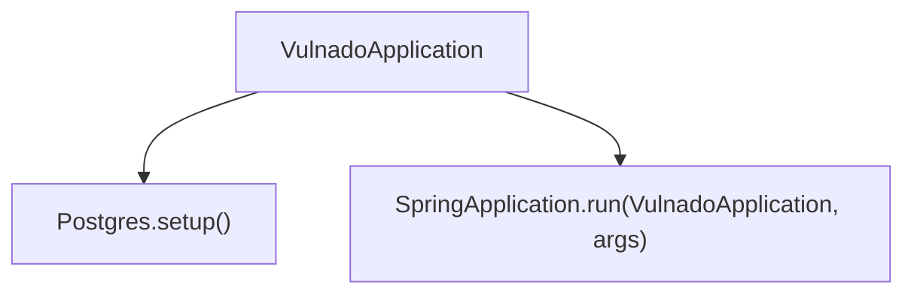
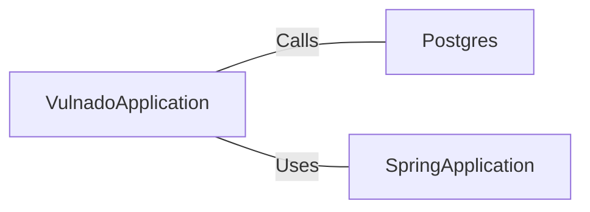

# VulnadoApplication.java: Spring Boot Application Initialization

## Overview
The `VulnadoApplication` class is responsible for initializing and running a Spring Boot application. It sets up the necessary configurations and starts the application.

## Process Flow

## Insights
- The class uses annotations `@ServletComponentScan` and `@SpringBootApplication` to configure the Spring Boot application.
- The `main` method calls `Postgres.setup()` before running the Spring Boot application, indicating that some setup related to PostgreSQL is performed.

## Dependencies

- `Postgres`: The `setup` method is called to perform PostgreSQL related setup.
- `SpringApplication`: The `run` method is used to start the Spring Boot application.
