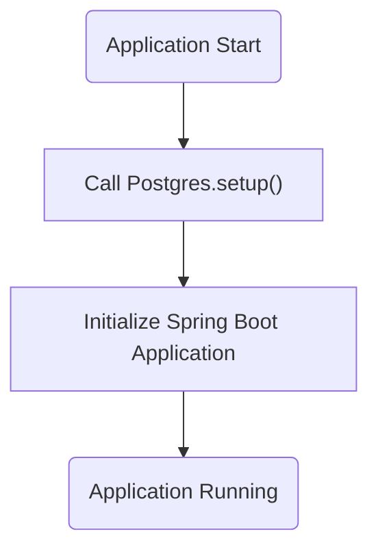
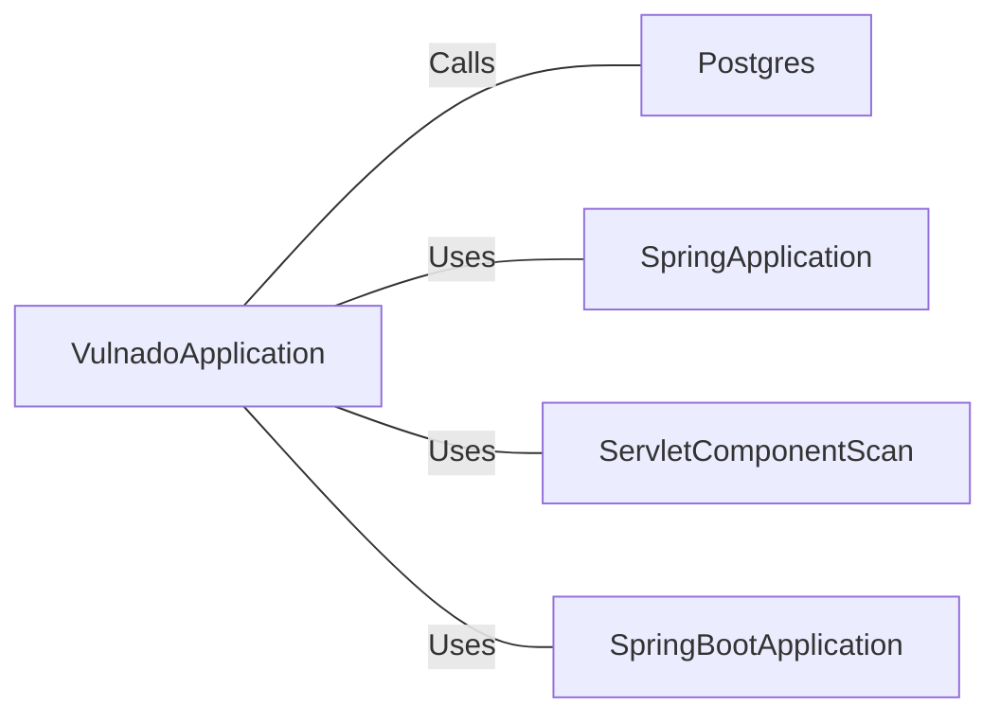

# VulnadoApplication.java: Main Application Entry Point

## Overview
This file serves as the main entry point for the `Vulnado` application. It initializes the Spring Boot application and sets up the necessary configurations, including database setup through the `Postgres.setup()` method.

## Process Flow

```mermaid
flowchart TD
    Start("Application Start") --> PostgresSetup["Call Postgres.setup()"]
    PostgresSetup --> SpringBootRun["Initialize Spring Boot Application"]
    SpringBootRun --> End("Application Running")
```

## Insights
- The `@SpringBootApplication` annotation enables auto-configuration, component scanning, and configuration properties for the Spring Boot application.
- The `@ServletComponentScan` annotation allows the application to scan for servlet components such as filters and listeners.
- The `Postgres.setup()` method is invoked before the Spring Boot application starts, indicating that some database setup or initialization is required.
- The `SpringApplication.run()` method is responsible for bootstrapping the Spring Boot application.

## Dependencies

```mermaid
flowchart LR
    VulnadoApplication --- |"Calls"| Postgres
    VulnadoApplication --- |"Uses"| SpringApplication
    VulnadoApplication --- |"Uses"| ServletComponentScan
    VulnadoApplication --- |"Uses"| SpringBootApplication
```

- `Postgres`: The `setup()` method is called to perform database-related initialization.
- `SpringApplication`: Used to bootstrap and launch the Spring Boot application.
- `ServletComponentScan`: Enables scanning for servlet components.
- `SpringBootApplication`: Combines several Spring Boot annotations for configuration and setup.

## Vulnerabilities
- **Potential Database Misconfiguration**: The `Postgres.setup()` method is invoked, but its implementation is not shown. If this method contains hardcoded credentials, insecure configurations, or lacks proper error handling, it could introduce vulnerabilities.
- **Servlet Scanning Risks**: The `@ServletComponentScan` annotation scans for servlet components. If untrusted or malicious components are inadvertently included, it could lead to security risks.
- **Lack of Input Validation**: If the application relies on user input during startup (e.g., environment variables or configuration files), ensure proper validation to prevent injection attacks.
