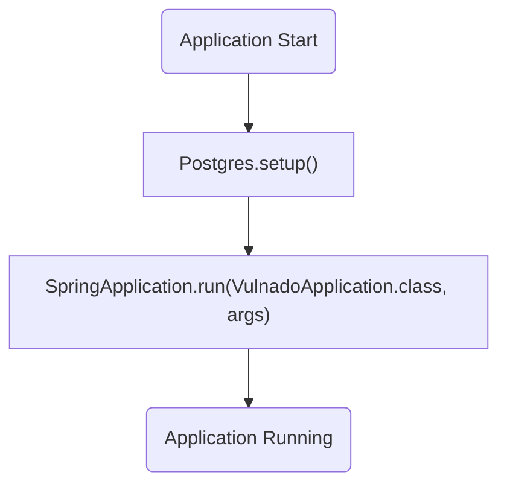
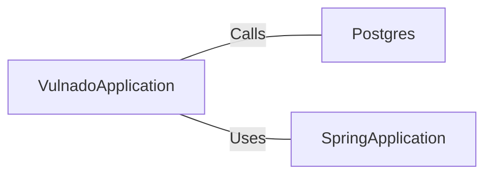

# VulnadoApplication.java: Main Application Entry Point

## Overview
This file serves as the main entry point for the `Vulnado` application. It initializes the Spring Boot application and sets up the necessary configurations, including database setup through the `Postgres` class.

## Process Flow

```mermaid
flowchart TD
    Start("Application Start") --> SetupPostgres["Postgres.setup()"]
    SetupPostgres --> SpringBootRun["SpringApplication.run(VulnadoApplication.class, args)"]
    SpringBootRun --> End("Application Running")
```

## Insights
- The `@SpringBootApplication` annotation marks this class as the main configuration and entry point for the Spring Boot application.
- The `@ServletComponentScan` annotation enables scanning for servlet components such as filters and listeners.
- The `Postgres.setup()` method is invoked before starting the Spring Boot application, indicating that database setup is a prerequisite for the application to run.
- The `SpringApplication.run()` method starts the Spring Boot application lifecycle.

## Dependencies

```mermaid
flowchart LR
    VulnadoApplication --- |"Calls"| Postgres
    VulnadoApplication --- |"Uses"| SpringApplication
```

- `Postgres`: Responsible for setting up the database. The method `setup()` is called during application initialization.
- `SpringApplication`: Used to bootstrap and launch the Spring Boot application.

## Vulnerabilities
- **Potential Database Misconfiguration**: The `Postgres.setup()` method is called, but its implementation is not shown here. If it involves hardcoded credentials, insecure connections, or improper error handling, it could lead to vulnerabilities.
- **Servlet Scanning Risks**: The `@ServletComponentScan` annotation enables scanning for servlet components. If untrusted or malicious components are inadvertently included, it could introduce security risks.
- **Lack of Input Validation**: If the application accepts user input during startup (e.g., through environment variables or command-line arguments), there is a risk of injection attacks if proper validation is not implemented.
