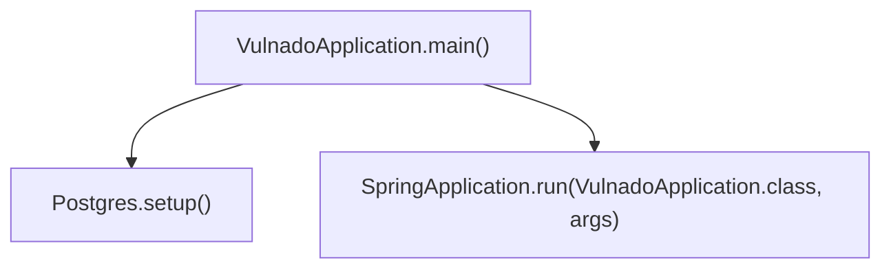
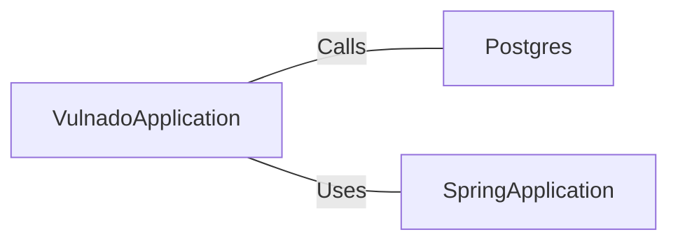

# VulnadoApplication.java: Main Application Entry Point

## Overview
The `VulnadoApplication` class serves as the main entry point for the Spring Boot application. It initializes the application by setting up the PostgreSQL database and running the Spring Boot application.

## Process Flow

```mermaid
flowchart TD
    A["VulnadoApplication.main()"] --> B["Postgres.setup()"]
    A --> C["SpringApplication.run(VulnadoApplication.class, args)"]
```

## Insights
- The class is annotated with `@SpringBootApplication` and `@ServletComponentScan`, indicating it is a Spring Boot application and will scan for servlet components.
- The `main` method is the entry point of the application.
- The `Postgres.setup()` method is called to set up the PostgreSQL database before running the Spring Boot application.

## Dependencies

```mermaid
flowchart LR
    VulnadoApplication --- |"Calls"| Postgres
    VulnadoApplication --- |"Uses"| SpringApplication
```

- `Postgres`: The `setup` method is called to initialize the PostgreSQL database.
- `SpringApplication`: The `run` method is used to start the Spring Boot application.
