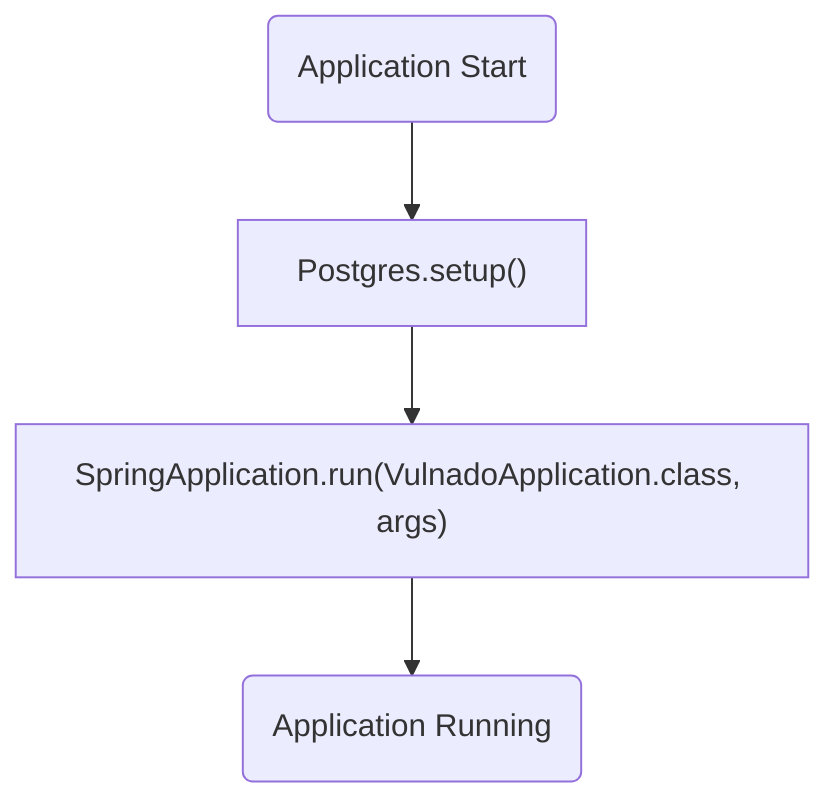
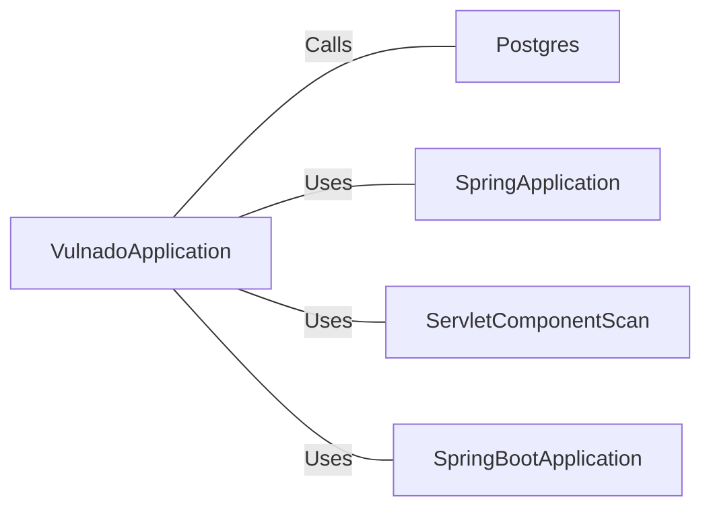

# VulnadoApplication.java: Main Application Entry Point for Vulnado

## Overview
This file serves as the main entry point for the `Vulnado` application. It initializes the Spring Boot application and sets up the necessary configurations, including database setup through the `Postgres` class.

## Process Flow

```mermaid
flowchart TD
    Start("Application Start") --> SetupPostgres["Postgres.setup()"]
    SetupPostgres --> SpringBootRun["SpringApplication.run(VulnadoApplication.class, args)"]
    SpringBootRun --> End("Application Running")
```

## Insights
- The application uses Spring Boot as its framework, indicated by the `@SpringBootApplication` annotation.
- The `@ServletComponentScan` annotation enables scanning for servlet components such as filters and listeners.
- The `Postgres.setup()` method is invoked before the Spring Boot application starts, suggesting that it handles database initialization or configuration.
- The `SpringApplication.run()` method is responsible for bootstrapping the application.

## Dependencies

```mermaid
flowchart LR
    VulnadoApplication --- |"Calls"| Postgres
    VulnadoApplication --- |"Uses"| SpringApplication
    VulnadoApplication --- |"Uses"| ServletComponentScan
    VulnadoApplication --- |"Uses"| SpringBootApplication
```

- `Postgres`: Handles database setup. The `setup()` method is called during application initialization.
- `SpringApplication`: Used to bootstrap and launch the Spring Boot application.
- `ServletComponentScan`: Enables scanning for servlet components.
- `SpringBootApplication`: Marks the class as a Spring Boot application and enables auto-configuration.

## Vulnerabilities
- **Potential Database Misconfiguration**: The `Postgres.setup()` method is invoked, but its implementation is not shown. If it does not properly handle sensitive data (e.g., credentials) or fails to validate inputs, it could lead to vulnerabilities such as SQL injection or insecure database connections.
- **Servlet Component Exposure**: The `@ServletComponentScan` annotation scans for servlet components. If improperly configured, it could expose sensitive endpoints or allow unauthorized access.
- **Lack of Input Validation**: If the application relies on user input during initialization (e.g., environment variables or configuration files), improper validation could lead to security risks.
