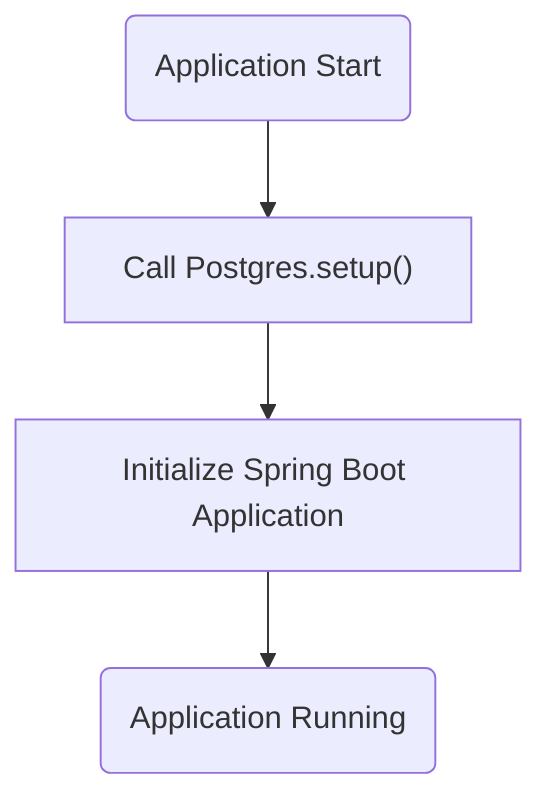
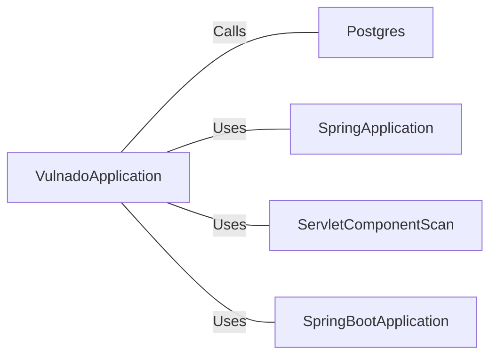

# VulnadoApplication.java: Main Application Entry Point

## Overview
This file serves as the main entry point for the `Vulnado` application. It initializes the Spring Boot application and sets up the necessary configurations, including database setup through the `Postgres.setup()` method.

## Process Flow

```mermaid
flowchart TD
    Start("Application Start") --> SetupPostgres["Call Postgres.setup()"]
    SetupPostgres --> InitializeSpring["Initialize Spring Boot Application"]
    InitializeSpring --> End("Application Running")
```

## Insights
- The `@SpringBootApplication` annotation marks this class as the main configuration class for the Spring Boot application.
- The `@ServletComponentScan` annotation enables scanning for servlet components, such as filters and listeners, within the application.
- The `Postgres.setup()` method is invoked before the Spring Boot application starts, indicating that database setup is a prerequisite for the application.

## Dependencies

```mermaid
flowchart LR
    VulnadoApplication --- |"Calls"| Postgres
    VulnadoApplication --- |"Uses"| SpringApplication
    VulnadoApplication --- |"Uses"| ServletComponentScan
    VulnadoApplication --- |"Uses"| SpringBootApplication
```

- `Postgres`: The `setup()` method is called to initialize the database connection or configuration.
- `SpringApplication`: Used to bootstrap and launch the Spring Boot application.
- `ServletComponentScan`: Enables scanning for servlet components.
- `SpringBootApplication`: Marks the class as the main Spring Boot application configuration.

## Vulnerabilities
- **Potential Database Misconfiguration**: The `Postgres.setup()` method is called, but its implementation is not shown. If this method does not handle sensitive data securely (e.g., credentials), it could lead to vulnerabilities such as hardcoded credentials or improper database access control.
- **Servlet Scanning Risks**: The `@ServletComponentScan` annotation enables scanning for servlet components, which could inadvertently include insecure or unnecessary components if not properly managed.
